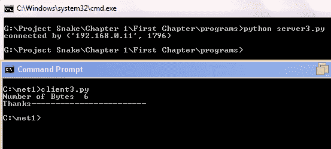
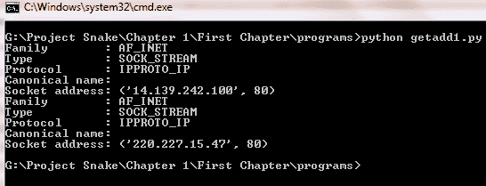

# 一、Python 渗透测试和网络

**渗透**（**笔**）测试员和黑客是类似的术语。不同之处在于，渗透测试人员为一个组织工作，以防止黑客企图，而黑客则为任何目的进行黑客攻击，如名誉、为钱出售漏洞或利用个人敌意的漏洞。

许多训练有素的黑客通过侵入一个系统，然后通知受害者他们的安全漏洞，以便修复这些漏洞，从而在信息安全领域找到了工作。

当黑客为组织或公司工作以保护其系统安全时，他们被称为渗透测试人员。pentester 在获得客户的法律批准后，进行黑客攻击，试图侵入网络，然后提交调查结果报告。要成为 pentesting 方面的专家，一个人应该对他们的技术概念有深入的了解。在本章中，我们将介绍以下主题：

*   五旬斋的范围
*   五旬斋的必要性
*   待测部件
*   优质戊酯的品质
*   五旬斋的方法
*   了解您需要的测试和工具
*   网络套接字
*   服务器套接字方法
*   客户端套接字方法
*   通用套接字方法
*   插座实例
*   套接字异常
*   有用的套接字方法

# 介绍 pentesting 的范围

简言之，渗透测试用于测试公司的信息安全措施。信息安全措施包括公司的网络、数据库、网站、面向公众的服务器、安全策略以及客户指定的所有其他内容。在一天结束时，pentester 必须提交一份详细的调查结果报告，如弱点、公司基础设施中的漏洞以及特定漏洞的风险水平，并在可能的情况下提供解决方案。

# 五旬斋的必要性

有几点描述了 pentesting 的重要性：

*   Pentesting 识别可能暴露组织机密性的威胁
*   专家 pentesting 通过对组织安全的完整和详细评估为组织提供保证
*   Pentesting 通过产生大量流量来评估网络的效率，并检查防火墙、路由器和交换机等设备的安全性
*   更改或升级现有的软件、硬件或网络设计基础架构可能会导致 pentesting 检测到的漏洞
*   在当今世界，潜在的威胁正在显著增加；pentesting 是一种积极主动的练习，旨在最大限度地减少被利用的机会
*   Pentesting 可确保是否遵循了适当的安全策略

考虑一个著名的电子商务公司的例子，从网上生意赚钱。一名黑客或一群黑帽黑客在公司网站上发现漏洞并进行攻击。这家公司将不得不承担巨大的损失。

# 待测部件

组织应在测试前进行风险评估操作；这将有助于识别以下方面的主要威胁，如错误配置或漏洞：

*   路由器、交换机或网关
*   面向公众的系统；网站、DMZ、电子邮件服务器和远程系统
*   DNS、防火墙、代理服务器、FTP 和 web 服务器

测试应在网络安全系统的所有硬件和软件组件上进行。

# 优质戊酯的品质

以下几点描述了良好戊酯的质量。他们应：

*   选择一套适当的测试和工具，以平衡成本和效益
*   遵循适当的程序，进行适当的规划和记录
*   确定每个渗透测试的范围，例如目标、限制和程序的正当性
*   准备好展示如何利用他们发现的漏洞
*   在最终报告中明确说明潜在风险和发现，并尽可能提供降低风险的方法
*   因为技术进步很快，所以随时更新自己

pentester 使用手动技术或相关工具测试网络。市场上有很多可用的工具。其中有些是开源的，有些是非常昂贵的。在编程的帮助下，程序员可以自己制作工具。通过创建您自己的工具，您可以明确您的概念，还可以执行更多的研发。如果您对 pentesting 感兴趣并想制作您自己的工具，那么 Python 编程语言是最好的，因为 Python 中提供了大量免费的 pentesting 包，而且编程简单。这种简单性，加上第三方库，如 scapy 和 mechanize，减少了代码大小。在 Python 中，要生成程序，不需要定义 Java 之类的大类。用 Python 编写代码比用 C 编写代码效率更高，而且高级库可以轻松地用于几乎任何可以想象的任务。

如果您了解一些 Python 编程，并且对 pentesting 感兴趣，那么这本书非常适合您。

# 定义 pentesting 的范围

在我们进入 pentesting 之前，应该定义 pentesting 的范围。定义范围时应考虑以下几点：

*   你应该通过咨询客户来确定项目的范围。例如，如果 Bob（客户机）想要测试组织的整个网络基础设施，那么 pentester Alice 将通过考虑该网络来定义 pentesting 的范围。Alice 将咨询 Bob 是否应包括任何敏感或限制区域。
*   你应该考虑到时间、人和金钱。
*   您应该根据 pentester 和客户签署的协议来分析测试边界。
*   业务实践的变化可能会影响范围。例如，添加子网、安装新的系统组件、添加或修改 web 服务器等可能会更改 pentesting 的范围。

测试范围在两种类型的测试中定义：

*   **非破坏性试验**：该试验仅限于发现和执行无任何潜在风险的试验。它执行以下操作：
    *   扫描并识别远程系统的潜在漏洞
    *   调查并核实调查结果
    *   利用适当的漏洞来映射漏洞
    *   小心地利用远程系统以避免中断
    *   提供概念证明
    *   不尝试**拒绝服务**（**拒绝服务**攻击
*   **破坏性试验**：该试验会产生风险。它执行以下操作：
    *   尝试 DoS 攻击和缓冲区溢出攻击，这可能导致系统崩溃

# 五旬斋的方法

pentesting 有三种方法：

*   黑盒测试遵循非确定性测试方法：
    *   您将只获得一个公司名称
    *   这就像是利用外部攻击者的知识进行黑客攻击
    *   您不需要事先了解系统
    *   这很费时
*   白盒测试遵循确定性测试方法：
    *   您将获得需要测试的基础设施的完整知识
    *   这就像是一个对公司基础设施有充分了解的恶意员工
    *   将向您提供有关公司基础设施、网络类型、公司政策、注意事项、IP 地址和 IPS/IDS 防火墙的信息
*   灰盒测试遵循黑盒和白盒测试的混合方法：
    *   测试人员通常在客户提供的目标网络/系统上拥有有限的信息，以降低成本并减少测试人员的尝试和错误
    *   它在内部执行安全评估和测试

# 介绍 Python 脚本

在开始阅读本书之前，您应该了解 Python 编程的基础知识，例如基本语法、变量类型、数据类型元组、列表字典、函数、字符串和方法。两个版本，3.4 和 2.7.8，可在[python.org/downloads/](http://python.org/downloads/)上获得。

在本书中，所有的实验和演示都是在 Python 版本 2.7.8 中完成的。如果您使用诸如 Kali 或 BackTrack 之类的 Linux 操作系统，那么就不会有问题，因为许多程序（如无线监听）在 Windows 平台上不起作用。Kali Linux 也使用 2.7 版本。如果你喜欢在红帽或 CentOS 上工作，那么这个版本很适合你。

大多数黑客选择这个职业是因为他们不想做编程。他们想使用工具。然而，如果没有编程，黑客就无法提高自己的技能。每一次，他们都必须在互联网上搜索这些工具。相信我，在看到它的简单之后，你会爱上这种语言的。

# 了解您需要的测试和工具

如你所见，这本书分为九章。要进行扫描和嗅探测试，您需要一个连接设备的小型网络。如果你没有实验室，你可以在你的计算机上制作虚拟机。对于无线流量分析，您应该有一个无线网络。要进行 web 攻击，需要在 Linux 平台上运行 Apache 服务器。最好在 web 服务器上使用 CentOS 或 Red Hat 版本 5 或 6，因为其中包含 Apache 和 PHP 的 RPM。对于 Python 脚本，我们将使用 Wireshark 工具，它是开源的，可以在 Windows 和 Linux 平台上运行。

# 使用 Python 学习通用测试平台

你现在将进行一些五旬斋；我希望您熟悉网络基础知识，如 IP 地址、有类子网、无类子网、端口、网络地址和广播地址的含义。pentester 必须精通网络基础知识以及至少一种操作系统；如果您正在考虑使用 Linux，那么您就走上了正确的道路。在本书中，我们将在 Windows 和 Linux 上执行我们的程序。在本书中，将使用 Windows、CentOS 和 Kali Linux。

黑客总是喜欢在 Linux 系统上工作。由于 Kali Linux 是一款免费的开源软件，它标志着 BackTrack 的重生，就像一个黑客工具库。Kali Linux NetHunter 是第一个针对 Nexus 设备的开源 Android 渗透测试平台。然而，有些工具在 Linux 和 Windows 上都可以工作，但是在 Windows 上，您必须安装这些工具。我希望你对 Linux 有所了解。现在，是在 Python 上使用网络的时候了。

# 网络套接字

网络套接字地址包含 IP 地址和端口号。用一种非常简单的方式，套接字是与其他计算机通信的一种方式。通过套接字，一个进程可以通过网络与另一个进程通信。

要创建套接字，请使用套接字模块中提供的`socket.socket()`。套接字函数的一般语法如下所示：

```py
s = socket.socket (socket_family, socket_type, protocol=0)
```

以下是参数的说明：

```py
socket_family: socket.AF_INET, PF_PACKET
```

`AF_INET`是 IPv4 的地址族。`PF_PACKET`在设备驱动层操作。Linux 的 pcap 库使用`PF_PACKET`。您将在[第 3 章](3.html)、*嗅探和渗透测试*中看到更多关于`PF_PACKET`的详细信息。这些参数表示传输层的地址族和协议：

```py
Socket_type : socket.SOCK_DGRAM, socket.SOCK_RAW,socket.SOCK_STREAM
```

`socket.SOCK_DGRAM`参数表示 UDP 不可靠且无连接，`socket.SOCK_STREAM`表示 TCP 可靠且是双向的、基于连接的服务。我们将在[第三章](3.html)*嗅探和渗透测试*中讨论`socket.SOCK_RAW`：

```py
protocol
```

一般来说，我们放弃这个论点；如果未指定，则接受 0。我们将在[第 3 章](3.html)、*嗅探和渗透测试*中看到此论点的使用。

# 服务器套接字方法

在客户机-服务器体系结构中，有一个提供服务的集中式服务器，许多客户机从集中式服务器请求和接收服务。以下是您需要了解的一些方法：

*   `socket.bind(address)`：此方法用于将地址（IP 地址、端口号）连接到套接字。在连接到该地址之前，必须先打开套接字。
*   `socket.listen(q)`：此方法启动 TCP 侦听器。`q`参数定义了排队连接的最大数量。
*   `socket.accept()`：此方法的用途是接受客户端的连接。在使用此方法之前，必须使用`socket.bind(address)`和`socket.listen(q)`方法。`socket.accept()`方法返回两个值`client_socket`和`address`，其中`client_socket`是用于通过连接发送和接收数据的新套接字对象，`address`是客户端的地址。稍后您将看到这方面的示例。

# 客户端套接字方法

专用于客户端的唯一方法如下所示：

*   `socket.connect(address)`：此方法将客户端连接到服务器。`address`参数是服务器的地址。

# 通用套接字方法

一般插座方法如下：

*   `socket.recv(bufsize)`：此方法从套接字接收 TCP 消息。`bufsize`参数定义了它在任何时候可以接收的最大数据量。
*   `socket.recvfrom(bufsize)`：此方法从套接字接收数据。该方法返回一对值，第一个值给出接收的数据，第二个值给出发送数据的套接字的地址。
*   `socket.recv_into(buffer)`：此方法接收小于等于`buffer`的数据。`buffer`参数由`bytearray()`方法创建。我们将在稍后的示例中讨论这一点。
*   `socket.recvfrom_into(buffer)`：此方法从套接字获取数据并写入缓冲区。返回值是一对（nbytes，address），其中 nbytes 是接收的字节数，address 是发送数据的套接字的地址。

在较早版本的 Python 中使用`socket.recv from_into(buffer)`方法时要小心。在此方法中发现缓冲区溢出漏洞。该漏洞的名称为 CVE-2014-1912，其漏洞于 2014 年 2 月 27 日发布。Python 2.7.7 之前的 2.5 版本、3.3.4 之前的 3.x 版本和 3.4rc1 之前的 3.4.x 版本中的`Modules/socketmodule.c`中的`socket.recvfrom_into`函数存在缓冲区溢出，远程攻击者可以通过特制的字符串执行任意代码。

*   `socket.send(bytes)`：此方法用于向套接字发送数据。发送数据之前，请确保套接字已连接到远程计算机。它返回发送的字节数。
*   `socket.sendto(data, address)`：此方法用于向套接字发送数据。通常，我们在 UDP 中使用这种方法。UDP 是一种无连接协议；因此，套接字不应连接到远程计算机，address 参数指定远程计算机的地址。返回的值告诉我们发送的字节数。
*   `socket.sendall(data)`：顾名思义，此方法将所有数据发送到套接字。发送数据之前，请确保套接字已连接到远程计算机。此方法不间断地传输数据，直到发现错误为止。如果发现错误，将出现异常，`socket.close()`将关闭套接字。

现在，是时候采取实际行动了；不再有世俗的理论了。

# 继续讨论实际问题

首先，我们将制作一个服务器端程序，提供到客户端的连接并向客户端发送消息。运行`server1.py`：

```py
import socket
host = "192.168.0.1" #Server address
port = 12345  #Port of Server
s = socket.socket(socket.AF_INET, socket.SOCK_STREAM)
s.bind((host,port)) #bind server 
s.listen(2) 
conn, addr = s.accept()  
print addr, "Now Connected"
conn.send("Thank you for connecting")
conn.close()
```

前面的代码非常简单；这是服务器端的最小代码。

首先导入 socket 模块，定义主机和端口号，`192.168.0.1`是服务器的 IP 地址。`Socket.AF_INET`定义了 IPv4 协议的系列。`Socket.SOCK_STREAM`定义 TCP 连接。`s.bind((host,port))`语句只接受一个参数。它将套接字绑定到主机和端口号。`s.listen(2)`语句侦听连接并等待客户端。`conn, addr = s.accept()`语句返回两个值：`conn`和`addr`。正如我们前面所讨论的，`conn`套接字是客户机套接字。`conn.send()`功能向客户端发送消息。最后，`conn.close()`关闭插座。通过以下示例和屏幕截图，您将更好地理解`conn`。

这是`server1.py`程序的输出：

```py
  G:PythonNetworking>python server1.py
```

现在，服务器处于侦听模式，正在等待客户端。

让我们看看客户端代码。运行`client1.py`：

```py
import socket
s = socket.socket(socket.AF_INET, socket.SOCK_STREAM)
host = "192.168.0.1"  # server address
port =12345  #server port 
s.connect((host,port)) 
print s.recv(1024)
s.send("Hello Server")
s.close()
```

在前面的代码中，有两个新方法，`s.connect((host,port))`将客户端连接到服务器，还有`s.recv(1024)`接收服务器发送的字符串。

`client.py`的输出和服务器的响应如下图所示：


前面的输出屏幕截图显示服务器接受了来自`192.168.0.11`的连接。不要因为看到端口`1789`而感到困惑；它是客户端的随机端口。当服务器向客户端发送消息时，它使用前面提到的`conn`套接字，而这个`conn`套接字包含客户端 IP 地址和端口号。

下图显示了客户端如何接受来自服务器的连接。服务器处于侦听模式，客户端连接到服务器。当您再次运行服务器和客户端程序时，随机端口会发生更改。对于客户端，服务器端口**12345**为目标端口，对于服务器，客户端随机端口**1789**为目标端口：


TCP 通信

您可以使用`while`循环扩展服务器的功能，如以下程序所示。运行`server2.py`程序：

```py
import socket 
host = "192.168.0.1"
port = 12345
s = socket.socket(socket.AF_INET, socket.SOCK_STREAM)
s.bind((host,port))
s.listen(2)
while True:
  conn, addr = s.accept()
  print addr, "Now Connected"
  conn.send("Thank you for connecting")
  conn.close()
```

前面的代码与前面的代码相同，只是增加了无限`while`循环。

运行`server2.py`程序，从客户端运行`client1.py`。

`server2.py`的输出如下图所示：


一台服务器可以为多个客户端提供服务。`while`循环使服务器程序保持活动状态，不允许代码结束。您可以设置`while`环路的连接限制；例如，对每个连接设置`while i>10`和增加`i`。

在继续下一个示例之前，应该理解`bytearray`的概念。`bytearray`数组是 0 到 255 范围内的无符号整数的可变序列。可以删除、插入或替换任意值或切片。通过调用内置的`bytearray`数组，可以创建`bytearray`数组的对象。

`bytearray`的一般语法如下：

```py
bytearray([source[, encoding[, errors]]])
```

让我们用一个例子来说明这一点：

```py
>>> m = bytearray("Mohit Mohit")
>>> m[1]
111
>>> m[0]
77
>>> m[:5]= "Hello"
>>> m
bytearray(b'Hello Mohit')
>>>
```

这是一个切片`bytearray`的示例。

现在我们来看一下`bytearray()`上的`split`操作：

```py
>>> m = bytearray("Hello Mohit")
>>> m
bytearray(b'Hello Mohit')
>>> m.split()
[bytearray(b'Hello'), bytearray(b'Mohit')]
```

以下是`bytearray()`上的`append`操作：

```py
>>> m.append(33)
>>> m
bytearray(b'Hello Mohit!')
>>> bytearray(b'Hello World!')
```

下一个例子是`s.recv_into(buff)`。在本例中，我们将使用`bytearray()`创建一个缓冲区来存储数据。

首先，运行服务器端代码。运行`server3.py`：

```py
import socket
host = "192.168.0.1"
port = 12345
s = socket.socket(socket.AF_INET, socket.SOCK_STREAM)
s.bind((host, port))
s.listen(1)
conn, addr = s.accept()
print "connected by", addr
conn.send("Thanks")
conn.close()
```

前面的程序与前面的程序相同。在本程序中，服务器发送`Thanks`；六个字符。

让我们运行客户端程序。运行`client3.py`：

```py
import socket
host = "192.168.0.1"
port = 12345
s = socket.socket(socket.AF_INET, socket.SOCK_STREAM)
s.connect((host, port))
buf = bytearray("-" * 30) # buffer created
print "Number of Bytes ",s.recv_into(buf) 
print buf
s.close
```

在前面的程序中，使用`bytearray()`创建`buf`参数。`s.recv_into(buf)`语句给出了接收到的字节数。`buf`参数为我们提供接收到的字符串。

`client3.py`和`server3.py`的输出如下图所示：



我们的客户端程序成功地接收到 6 字节的字符串`Thanks`。你现在一定对`bytearray()`有了概念。我希望你会记得。

这次，我将创建一个 UDP 套接字。

运行`udp1.py`，我们将逐行讨论代码：

```py
import socket
host = "192.168.0.1"
port = 12346
s = socket.socket(socket.AF_INET, socket.SOCK_DGRAM)
s.bind((host,port))
data, addr = s.recvfrom(1024)
print "received from ",addr
print "obtained ", data
s.close()
```

`socket.SOCK_DGRAM`创建一个 UDP 套接字，`data, addr = s.recvfrom(1024)`返回两个内容，第一个是数据，第二个是源地址。

现在，请参阅客户端准备。运行`udp2.py`：

```py
import socket
host = "192.168.0.1"
port = 12346
s = socket.socket(socket.AF_INET, socket.SOCK_DGRAM)
print s.sendto("hello all",(host,port))
s.close()
```

在这里，我使用了 UDP 套接字和`s.sendto()`方法，正如您在`socket.sendto()`的定义中所看到的。您将知道 UDP 是一个无连接的协议，因此不需要在这里建立连接。

以下屏幕截图显示了`udp1.py`（UDP 服务器）和`udp2.py`（UDP 客户端）的输出：


服务器程序已成功接收数据。

让我们假设服务器正在运行，并且没有客户机启动连接，并且服务器将一直在侦听。因此，为了避免这种情况，请使用`socket.settimeout(value)`。

通常，我们以整数形式给出一个值；如果我给`5`作为值，这意味着等待 5 秒。如果操作未在 5 秒内完成，则会引发超时异常。还可以提供非负浮点值。

例如，让我们看一下以下代码：

```py
import socket
host = "192.168.0.1"
port = 12346
s = socket.socket(socket.AF_INET, socket.SOCK_DGRAM)
s.bind((host,port))
s.settimeout(5)
data, addr = s.recvfrom(1024)
print "recevied from ",addr
print "obtained ", data
s.close()
```

我加了一行，就是`s.settimeout(5)`。程序等待五秒钟；只有在这之后，它才会给我们一个错误消息。运行`udptime1.py`。

输出如以下屏幕截图所示：


程序显示错误；但是，如果它给出错误消息，则看起来不太好。程序应该处理异常。

# 套接字异常

为了处理异常，我们将使用 try 和 except 块。下面的示例将告诉您如何处理异常。运行`udptime2.py`：

```py
import socket
host = "192.168.0.1"
port = 12346
s = socket.socket(socket.AF_INET, socket.SOCK_DGRAM)
try:

  s.bind((host,port))
  s.settimeout(5)
  data, addr = s.recvfrom(1024)
  print "recevied from ",addr
  print "obtained ", data
  s.close()

except socket.timeout :
  print "Client not connected"
  s.close()
```

输出如以下屏幕截图所示：


在 try 块中，我放入代码，如果出现任何异常，将从 except 块打印自定义消息。

Python 的套接字库中为不同的错误定义了不同类型的异常。这些例外情况如下所述：

*   `exception socket.herror`：此块捕获与地址相关的错误。
*   `exception socket.timeout`：此块捕获套接字超时时的异常，此异常已由`settimeout()`启用。在前面的示例中，您可以看到我们使用了`socket.timeout`。
*   `exception socket.gaierror`：此块捕获由于`getaddrinfo()`和`getnameinfo()`而引发的任何异常。
*   `exception socket.error`：此块捕获任何与套接字相关的错误。如果您不确定是否有任何异常，可以使用此选项。换句话说，您可以说它是一个泛型块，可以捕获任何类型的异常。

下载示例代码

您可以从您的账户[下载示例代码文件 http://www.packtpub.com](http://www.packtpub.com) 对于您购买的所有 Packt 出版书籍。如果您在其他地方购买了本书，您可以访问[http://www.packtpub.com/support](http://www.packtpub.com/support) 并注册，将文件直接通过电子邮件发送给您。

# 有用的套接字方法

到目前为止，您已经了解了套接字和客户机-服务器体系结构。在这个级别上，您可以制作一个小型的网络程序。然而，本书的目的是测试网络和收集信息。Python 提供了非常漂亮而且有用的方法来收集信息。首先，导入套接字，然后使用以下方法：

*   `socket.gethostbyname(hostname)`：此方法将主机名转换为 IPv4 地址格式。IPv4 地址以字符串形式返回。以下是一个例子：

```py
 >>> import socket>>>   
       socket.gethostbyname('thapar.edu')'220.227.15.55'>>>>>>   
       socket.gethostbyname('google.com')'173.194.126.64'>>>
```

我知道你在考虑`nslookup`命令。稍后，你会看到更多的魔法。

*   `socket.gethostbyname_ex(name)`：此方法将主机名转换为 IPv4 地址模式。然而，与前面的方法相比，它的优势在于它给出了域名的所有 IP 地址。它返回一个元组（hostname、canonical name 和 IP_addrlist），其中主机名由我们提供，canonical name 是同一地址的服务器的规范主机名列表（可能为空），IP_addrlist 是同一主机名的所有可用 IP 地址的列表。通常，一个域名托管在多个 IP 地址上，以平衡服务器的负载。不幸的是，这种方法不适用于 IPv6。我希望您熟悉元组、列表和字典。让我们看一个例子：

```py
 >>> socket.gethostbyname_ex('thapar.edu')('thapar.edu', [],  
       ['14.139.242.100', '220.227.15.55'])>>> 
       socket.gethostbyname_ex('google.com')>>>('google.com', [], 
       ['173.194.36.64', '173.194.36.71', '173.194.36.73',   
       '173.194.36.70', 
       '173.194.36.78', '173.194.36.66', '173.194.36.65', 
       '173.194.36.68', 
       '173.194.36.69', '173.194.36.72', '173.194.36.67'])>>>
```

它返回单个域名的多个 IP 地址。这意味着`thapar.edu`或`google.com`等一个域在多个 IP 上运行。

*   `socket.gethostname()`：返回 Python 解释器当前运行的系统的主机名：

```py
 >>> socket.gethostname()'eXtreme'
```

要使用套接字模块收集当前机器的 IP 地址，可以使用以下技巧使用`gethostbyname(gethostname())`：

```py
 >>> socket.gethostbyname(socket.gethostname())'192.168.10.1'>>>
```

你知道我们的计算机有很多接口。如果要知道所有接口的 IP 地址，请使用扩展接口：。

```py
 >>> socket.gethostbyname_ex(socket.gethostname())('eXtreme', [], 
 ['10.0.0.10', '192.168.10.1', '192.168.0.1'])>>>
```

它返回一个包含三个元素的元组，第一个是机器名，第二个是主机名的别名列表（本例中为空），第三个是接口的 IP 地址列表。

*   `socket.getfqdn([name])`：用于查找完全限定的域名（如果有）。完全限定域名由主机和域名组成；例如，`beta`可能是主机名，`example.com`可能是域名。**完全限定域名**（**FQDN**变为`beta.example.com`：

```py
 >>> socket.getfqdn('facebook.com')'edge-star-shv-12- 
 frc3.facebook.com'
```

在上例中，`edge-star-shv-12-frc3`是主机名，`facebook.com`是域名。在以下示例中，FQDN 不适用于`thapar.edu`：

```py
 >>> socket.getfqdn('thapar.edu')'thapar.edu'
```

如果 name 参数为空，则返回当前计算机名称：

```py
 >>> socket.getfqdn()'eXtreme'>>>
```

*   `socket.gethostbyaddr(ip_address)`：这就像是对名称的*反向*查找。它返回一个元组（hostname、canonical name 和 IP_addrlist），其中 hostname 是响应给定`ip_address`的主机名，canonical name 是同一地址的规范名称列表（可能为空），IP_addrlist 是同一主机上同一网络接口的 IP 地址列表：

```py
 >>> socket.gethostbyaddr('173.194.36.71')('del01s06-in-
      f7.1e100.net', [], ['173.194.36.71'])>>>    
      socket.gethostbyaddr('119.18.50.66')Traceback (most recent call   
      last):  File "<pyshell#9>", line 1, in <module>    
      socket.gethostbyaddr('119.18.50.66')herror: [Errno 11004] host 
      not found
```

它在上次查询中显示错误，因为不存在反向 DNS 查找。

*   `socket.getservbyname(servicename[, protocol_name])`：将任何协议名称转换为相应的端口号。协议名称是可选的，可以是 TCP 或 UDP。例如，DNS 服务使用 TCP 和 UDP 连接。如果未给出协议名称，则任何协议都可以匹配：

```py
 >>> import socket>>> socket.getservbyname('http')80>>>   
      socket.getservbyname('smtp','tcp')25>>>
```

*   `socket.getservbyport(port[, protocol_name])`：将互联网端口号转换为相应的服务名称。协议名称是可选的，TCP 或 UDP：

```py
 >>> socket.getservbyport(80)'http'>>>    
      socket.getservbyport(23)'telnet'>>>    
      socket.getservbyport(445)'microsoft-ds'>>>
```

*   `socket.connect_ex(address)`：此方法返回一个错误指示器。成功返回`0`；否则返回`errno`变量。您可以利用此功能扫描端口。运行`connect_ex.py`程序：

```py
      import socket
      rmip ='127.0.0.1'
      portlist = [22,23,80,912,135,445,20]

      for port in portlist:
      sock= socket.socket(socket.AF_INET,socket.SOCK_STREAM)
      result = sock.connect_ex((rmip,port))
      print port,":", result
      sock.close()
```

输出如以下屏幕截图所示：


前面的程序输出显示端口`80`、`912`、`135 `和`445`打开。这是一个基本的端口扫描仪。程序正在使用 IP 地址`127.0.0.1`；这是一个环回地址，因此不可能存在任何连接问题。但是，当您遇到问题时，请在另一个端口列表较大的设备上执行此操作。这一次，您必须使用`socket.settimeout(value)`：

```py
socket.getaddrinfo(host, port[, family[, socktype[, proto[, flags]]]])
```

此套接字方法将主机和端口参数转换为五个元组的序列。

让我们来看看下面的例子：

```py
   >>> import socket
   >>> socket.getaddrinfo('www.thapar.edu', 'http')
   [(2, 1, 0, '', ('220.227.15.47', 80)), (2, 1, 0, '',  
   ('14.139.242.100', 80))]
   >>>
```

输出`2`表示族，`1`表示套接字类型，`0`表示协议，`''`表示规范名称，`('220.227.15.47', 80)`表示`2`套接字地址。然而，这个数字很难理解。打开套接字的目录。

使用以下代码以可读形式查找结果：

```py
import socket
def get_protnumber(prefix):
  return dict( (getattr(socket, a), a)
    for a in dir(socket)
      if a.startswith(prefix))

proto_fam = get_protnumber('AF_')
types = get_protnumber('SOCK_')
protocols = get_protnumber('IPPROTO_')

for res in socket.getaddrinfo('www.thapar.edu', 'http'):

  family, socktype, proto, canonname, sockaddr = res

  print 'Family        :', proto_fam[family]
  print 'Type          :', types[socktype]
  print 'Protocol      :', protocols[proto]
  print 'Canonical name:', canonname
  print 'Socket address:', sockaddr
```

代码的输出如以下屏幕截图所示：



上半部分使用将协议编号映射到其名称的`AF_`、`SOCK_`和`IPPROTO_`前缀制作字典。这本词典是由列表理解技术形成的。

代码的上半部分有时可能会令人困惑，但我们可以按如下方式单独执行代码：

```py
  >>> dict(( getattr(socket,n),n) for n in dir(socket) if 
  n.startswith('AF_'))
  {0: 'AF_UNSPEC', 2: 'AF_INET', 6: 'AF_IPX', 11: 'AF_SNA', 12:  
  'AF_DECnet', 16: 'AF_APPLETALK', 23: 'AF_INET6', 26: 'AF_IRDA'}
```

现在，这很容易理解。此代码通常用于获取协议编号：

```py
for res in socket.getaddrinfo('www.thapar.edu', 'http'):
```

如定义中所述，前一行代码返回五个值。然后将这些值与其对应的字典进行匹配。

# 总结

通过阅读本章，您已经了解了 Python 中的网络。本章的目的是完成后续章节的先决条件。从一开始，你就学会了五旬斋的必要性。Pentesting 用于识别组织中的威胁和漏洞。应该测试什么？这在协议中有规定；不要尝试测试协议中未提及的任何内容。协议是你的免出狱卡。pentester 应该具备最新技术的知识，在开始阅读本书之前，您应该具备一些 Python 知识。为了运行 Python 脚本，您应该有一个实验室设置、一个用于测试实时系统的计算机网络，以及在 Apache 服务器上运行的虚拟网站。

本章还讨论了套接字及其方法。服务器套接字方法定义了如何创建简单的服务器。服务器绑定自己的地址和端口以侦听连接。知道服务器地址和端口号的客户端连接到服务器以获得服务。一些套接字方法，如`socket.recv(bufsize)`、`socket.recvfrom(bufsize)`、`socket.recv_into(buffer)`、`socket.send(bytes)`等，对服务器和客户端都很有用。您学习了如何处理不同类型的异常。在*有用的套接字方法*部分，您了解了如何获取机器的 IP 地址和主机名，如何从域名中获取 IP 地址，反之亦然。

在下一章中，我们将介绍扫描 pentesting，其中包括检测活动主机的 IP 地址扫描。执行 IP 扫描时，使用 ping 扫描和 TCP 扫描。您将学习如何使用端口扫描程序检测远程主机上运行的服务。