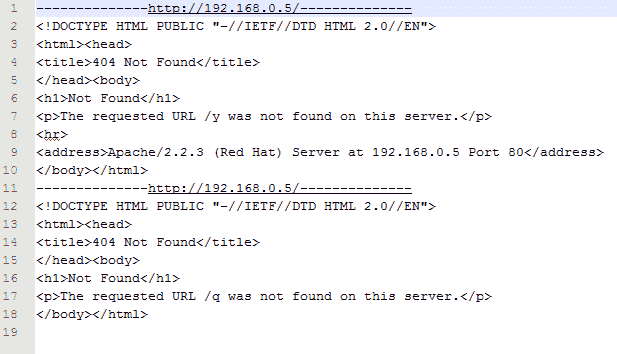
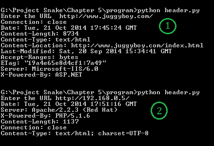
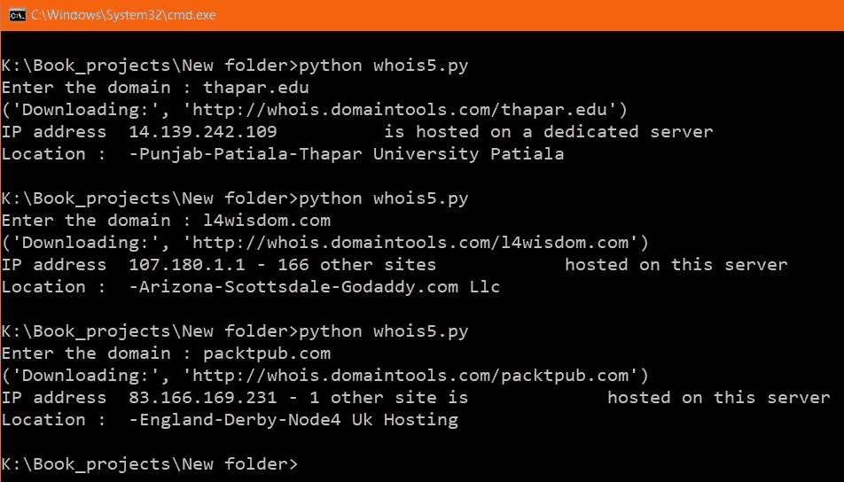

# 脚踏打印 Web 服务器和 Web 应用程序

到目前为止，我们已经阅读了四章相关内容，从数据链路层到传输层。现在，我们转到应用层渗透测试。在本章中，我们将介绍以下主题：

*   web 服务器的脚打印概念
*   介绍信息收集
*   HTTP 头检查
*   BeautifulSoup 解析器从 smartwhois.com 收集网站信息
*   网站的横幅抓取
*   强化 web 服务器

# web 服务器的脚打印概念

渗透测试的概念不能在一个步骤中解释或执行；因此，它被分为几个步骤。脚印是 pentesting 的第一步，攻击者试图收集有关目标的信息。在当今世界，电子商务发展迅速。因此，web 服务器已成为黑客的主要目标。为了攻击 web 服务器，我们必须首先知道 web 服务器是什么。我们还需要了解 web 服务器托管软件、托管操作系统以及 web 服务器上运行的应用程序。在获得这些信息后，我们可以建立我们的漏洞。获取此信息称为在 web 服务器上进行脚印。

# 介绍信息收集

在本节中，我们将尝试使用错误处理技术收集有关 web 服务器上运行的 web 软件、操作系统和应用程序的信息。从黑客的角度来看，从错误处理中收集信息并没有那么有用。但是，从 pentester 的角度来看，这非常重要，因为在提交给客户的 pentesting 最终报告中，您必须指定错误处理技术。

错误处理背后的逻辑是尝试在 web 服务器中产生错误，返回代码`404`，并查看错误页面的输出。我已经写了一个小代码来获得输出。我们将逐行检查以下代码：

```py
import re
import random
import urllib
url1 = raw_input("Enter the URL ")
u = chr(random.randint(97,122))
url2 = url1+u
http_r = urllib.urlopen(url2)

content= http_r.read()flag =0
i=0
list1 = []
a_tag = "<*address>"
file_text = open("result.txt",'a')

while flag ==0:
  if http_r.code == 404:
    file_text.write("--------------")
    file_text.write(url1)
    file_text.write("--------------n")

    file_text.write(content)
    for match in re.finditer(a_tag,content):

      i=i+1
      s= match.start()
      e= match.end()
      list1.append(s)
      list1.append(e)
    if (i>0):
      print "Coding is not good"
    if len(list1)>0:
      a= list1[1]
      b= list1[2]

      print content[a:b]
    else:
      print "error handling seems ok"
    flag =1
  elif http_r.code == 200:
    print "Web page is using custom Error page"
    break
```

我已经导入了三个模块，`re`、`random`和`urllib`，分别负责正则表达式、生成随机数和 URL 相关活动。`url1 = raw_input("Enter the URL ")`语句要求提供网站的 URL，并将此 URL 存储在`url1`变量中。然后，`u = chr(random.randint(97,122))`语句创建一个随机字符。下一条语句将此字符添加到 URL 中，并将其存储在`url2`变量中。然后，`http_r = urllib.urlopen(url2)`语句打开`url2`页面，该页面存储在`http_r`变量中。`content= http_r.read()`语句将网页的所有内容转移到内容变量中：

```py
flag =0
i=0
list1 = []
a_tag = "<*address>"
file_text = open("result.txt",'a')
```

前面的代码定义了`i`变量标志和一个空列表，其意义我们将在后面讨论。`a_tag`变量的值为`"<*address>"`。`file_text`变量是在追加模式下打开`result.txt`文件的文件对象。`result.txt`文件存储结果。while`flag ==0:`语句表示我们希望`while`循环至少运行一次。`http_r.code`语句从 web 服务器返回状态代码。如果找不到页面，将返回一个`404`代码：

```py
file_text.write("--------------")
file_text.write(url1)
file_text.write("--------------n")

file_text.write(content)
```

前面的代码将页面的输出写入`result.txt`文件。

`for match in re.finditer(a_tag,content)`：语句找到`a_tag`模式，即错误页面中的`<address>`标记，因为我们对`<address>``</address>`标记之间的信息感兴趣。`s= match.start()`和`e= match.end()`语句表示`<address>`标签和`list1.append(s)`的起点和终点。`list1.append(e)`语句将这些点存储在列表中，以便我们以后使用。`i`变量大于`0`，表示错误页面中存在`<address>`标签。这意味着代码不好。`if len(list1)>0`：语句表示如果列表中至少有一个元素，那么变量`a`和`b`将成为关注点。下图显示了这些关注点：


获取地址标记值

`print content[a:b]`语句读取**a**和**b**点之间的输出，并设置`flag = 1`以中断`while`循环。`elif http_r.code == 200:`语句表示如果 HTTP 状态码为`200`，则打印`"Web page is using custom Error page"`消息。在这种情况下，如果错误页面返回代码`200`，则表示该错误正在由自定义页面处理。

现在是运行输出的时候了，我们将运行它两次。

服务器签名打开和关闭时的输出：


程序的两个输出

前面的屏幕截图显示了服务器签名打开时的输出。通过查看此输出，我们可以说 web 软件是 Apache，版本是 2.2.3，操作系统是 Red Hat。在下一个输出中，没有来自服务器的信息意味着服务器签名已关闭。有时有人使用 web 应用程序防火墙，比如 mod security，它提供了一个伪造的服务器签名。在这种情况下，您需要检查`result.txt`文件以获得完整、详细的输出。我们来查看`result.txt`的输出，如下图所示：



result.txt 的输出

当存在多个 URL 时，您可以列出所有这些 URL 并将其提供给程序，该文件将包含所有 URL 的输出。

# 检查 HTTP 头

通过查看网页的标题，可以获得相同的输出。有时，可以通过编程更改服务器错误输出。但是，检查标头可能会提供大量信息。一个非常小的代码可以为您提供一些非常详细的信息，如下所示：

```py
import urllib
url1 = raw_input("Enter the URL ")
http_r = urllib.urlopen(url1)
if http_r.code == 200:
  print http_r.headers
```

`print http_r.headers`语句提供 web 服务器的头。

结果如下：



获取标题信息

您会注意到，我们从程序中获取了两个输出。在第一次输出中，我们输入了`http://www.juggyboy.com/`作为 URL。该节目提供了很多有趣的信息，例如`Server: Microsoft-IIS/6.0`和`X-Powered-By: ASP.NET`；它推断该网站托管在 Windows 计算机上，web 软件为 IIS 6.0，ASP.NET 用于 web 应用程序编程。

在第二个输出中，我提供了本地机器的 IP 地址，即`http://192.168.0.5/`。该程序透露了一些秘密信息，例如 web 软件是 Apache2.2.3，它运行在 Red Hat 机器上，PHP 5.1 用于 web 应用程序编程。通过这种方式，您可以获得有关操作系统、web 服务器软件和 web 应用程序的信息。

现在，让我们看看如果服务器签名关闭，我们将得到什么输出：


当服务器签名关闭时

从前面的输出中，我们可以看到 Apache 正在运行。但是，它既不显示版本也不显示操作系统。对于 web 应用程序编程，使用了 PHP，但有时，输出不显示编程语言。为此，您必须解析网页以获得任何有用的信息，例如超链接。

如果要获取标题的详细信息，请打开标题目录，如以下代码所示：

```py
 >>> import urllib
  >>> http_r = urllib.urlopen("http://192.168.0.5/")
  >>> dir(http_r.headers)
  ['__contains__', '__delitem__', '__doc__', '__getitem__', '__init__', '__iter__', '__len__', 
 '__module__', '__setitem__', '__str__', 'addcontinue', 'addheader', 'dict', 'encodingheader', 'fp', 
 'get',  'getaddr', 'getaddrlist', 'getallmatchingheaders', 'getdate', 'getdate_tz', 'getencoding', 
 'getfirstmatchingheader', 'getheader', 'getheaders', 'getmaintype', 'getparam', 'getparamnames', 
 'getplist', 'getrawheader', 'getsubtype', 'gettype', 'has_key', 'headers', 'iscomment', 'isheader', 
 'islast', 'items', 'keys', 'maintype', 'parseplist', 'parsetype', 'plist', 'plisttext', 'readheaders', 
 'rewindbody', 'seekable', 'setdefault', 'startofbody', 'startofheaders', 'status', 'subtype', 'type', 
 'typeheader', 'unixfrom', 'values']
  >>> 
  >>> http_r.headers.type
  'text/html'
  >>> http_r.headers.typeheader
  'text/html; charset=UTF-8'
 >>>
```

# 从 whois.domaintools.com 收集网站信息

考虑一种情况，您希望从网页中收集所有超链接。在本节中，我们将通过编程实现这一点。另一方面，这也可以通过查看网页的源代码手动完成。然而，这需要一些时间。

因此，让我们了解一个非常漂亮的解析器 lxml。

让我们看看代码：

*   将使用以下模块：

```py
      from lxml.html import fromstring
      import requests
```

*   当您进入所需网站时，`request`模块获取该网站的数据：

```py
      domain = raw_input("Enter the domain : ")
      url = 'http://whois.domaintools.com/'+domain
      user_agent='wswp'
      headers = {'User-Agent': user_agent}
      resp = requests.get(url, headers=headers)
      html = resp.text
```

*   以下代码从网站数据中获取表格：

```py
      tree = fromstring(html)
      ip= tree.xpath('//*[@id="stats"]//table/tbody/tr//text()')
```

*   以下`for`循环从表数据中删除空格和空字符串：

```py
      list1 = []
      for each in ip:
        each = each.strip()
        if each =="":
          continue
        list1.append(each.strip("\n"))
```

*   以下代码行查找`'IP Address'`字符串的索引：

```py
      ip_index = list1.index('IP Address')
      print "IP address ", list1[ip_index+1]
```

*   下一行查找网站的位置：

```py
      loc1 = list1.index('IP Location')
      loc2 = list1.index('ASN')
      print 'Location : ', "".join(list1[loc1+1:loc2])
```

在前面的代码中，我只打印了网站的 IP 地址和位置。以下输出显示我在三个不同的网站上使用了该程序三次：我的学院网站、我的网站和出版商的网站。在三个输出中，我们得到了 IP 地址和位置：



# 从网页收集电子邮件地址

在本节中，我们将学习如何从网页中查找电子邮件地址。为了找到电子邮件地址，我们将使用正则表达式。方法非常简单：首先，从给定的网页获取所有数据，然后使用电子邮件正则表达式获取电子邮件地址。

让我们看看代码：

```py
import urllib
import re
from bs4 import BeautifulSoup
url = raw_input("Enter the URL ")
ht= urllib.urlopen(url)
html_page = ht.read()
email_pattern=re.compile(r'\b[\w.-]+?@\w+?\.\w+?\b')
for match in re.findall(email_pattern,html_page ):
  print match
```

前面的代码非常简单。`html_page`变量包含所有网页数据。`r'\b[\w.-]+?@\w+?\.\w+?\b'`正则表达式表示电子邮件地址

现在让我们看看输出：


前面的结果是绝对正确的。给定的 URL 网页是我出于测试目的制作的

# 网站的横幅抓取

在本节中，我们将获取一个网站的 HTTP 横幅。横幅抓取或 OS 指纹识别是一种确定目标 web 服务器上运行的操作系统的方法。在下面的程序中，我们将在我们的计算机上嗅探一个网站的数据包，就像我们在[第 3 章](3.html)、*嗅探和渗透测试*中所做的那样。

横幅抓取器的代码如下所示：

```py
import socket
import struct
import binascii
s = socket.socket(socket.PF_PACKET, socket.SOCK_RAW, socket.ntohs(0x0800))
while True:

  pkt  = s.recvfrom(2048)
  banner = pkt[0][54:533]
  print banner
  print "--"*40
```

既然您已经阅读了[第 3 章](3.html)、*嗅探和渗透测试*，那么您应该熟悉这段代码。`banner = pkt[0][54:533]`声明在这里是新的。在`pkt[0][54:]`之前，数据包包含 TCP、IP 和以太网信息。在做了一些跟踪和出错后，我发现横幅抓取信息位于`[54:533]`之间，您可以通过切片`[54:540], [54:545], [54:530]`等方式进行跟踪和出错。

要获得输出，您必须在程序运行时在 web 浏览器中打开网站，如以下屏幕截图所示：


抢旗

因此，前面的输出显示服务器是 MicrosoftIIS.6.0，而 ASP.NET 是正在使用的编程语言。我们得到的信息与我们在报头检查过程中收到的信息相同。请尝试此代码，并使用不同的状态代码获取更多信息。

通过使用前面的代码，您可以为自己准备信息收集报告。当我将信息收集方法应用到网站时，我通常会发现客户犯了很多错误。在下一节中，您将看到 web 服务器上最常见的错误。

# 强化 web 服务器

在本节中，让我们了解一些在 web 服务器上观察到的常见错误。我们还将讨论一些强化 web 服务器的要点：

*   始终隐藏服务器签名。
*   如果可能，设置一个虚假的服务器签名以误导攻击者。
*   处理错误。
*   如果可能，请使用虚拟环境（监禁）来运行应用程序。
*   尝试隐藏编程语言页面扩展，因为攻击者很难看到 web 应用程序的编程语言。
*   使用供应商提供的最新修补程序更新 web 服务器。它避免了任何利用 web 服务器的机会。至少可以保护服务器的已知漏洞。
*   不要使用第三方补丁来更新 web 服务器。第三方修补程序可能包含特洛伊木马或病毒。
*   不要在 web 服务器上安装其他应用程序。如果安装操作系统，如 RHEL 或 Windows，请不要安装其他不必要的软件，如 Office 或 Editor，因为它们可能包含漏洞。
*   关闭除`80`和`443`之外的所有端口。
*   不要在 web 服务器上安装任何不必要的编译器，如 gcc。如果攻击者破坏了 web 服务器并希望上载可执行文件，则 ID 或 IP 可以检测到该文件。在这种情况下，攻击者将在 web 服务器上上载代码文件（以文本文件的形式），并在 web 服务器上执行该文件。此执行可能会损坏 web 服务器。
*   设置活动用户数量限制，以防止 DDoS 攻击。
*   在 web 服务器上启用防火墙。防火墙做很多事情，比如关闭端口和过滤流量。

# 总结

在本章中，我们了解了 web 服务器签名的重要性，并且获得服务器签名是黑客攻击的第一步。

“给我六个小时砍树，前四个小时我要磨斧子。”

——亚伯拉罕·林肯

同样的情况也适用于我们的情况。在对 web 服务器发起攻击之前，最好准确地检查哪些服务正在其上运行。这是通过脚印 web 服务器来完成的。错误处理技术是一个被动过程。标题检查和横幅抓取是收集 web 服务器信息的活动过程。在本章中，我们还学习了 BeautifulSoup 解析器。超链接、标记和 ID 等部分可以从 BeautifulSoup 获得。在上一节中，我们介绍了一些强化 web 服务器的指导原则。如果您遵循这些准则，您可能会使您的 web 服务器难以受到攻击。

在下一章中，您将了解客户端验证和参数篡改。您将学习如何生成和检测 DoS 和 DDOS 攻击。